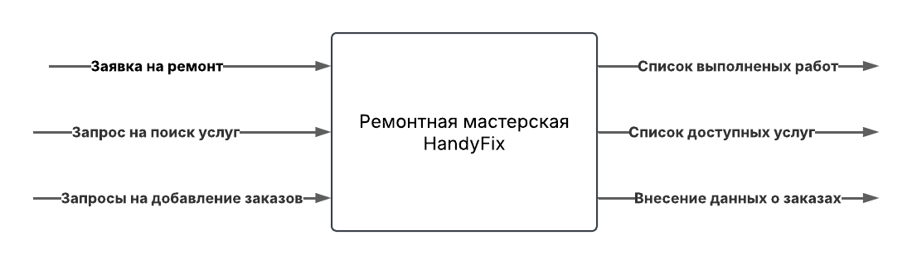
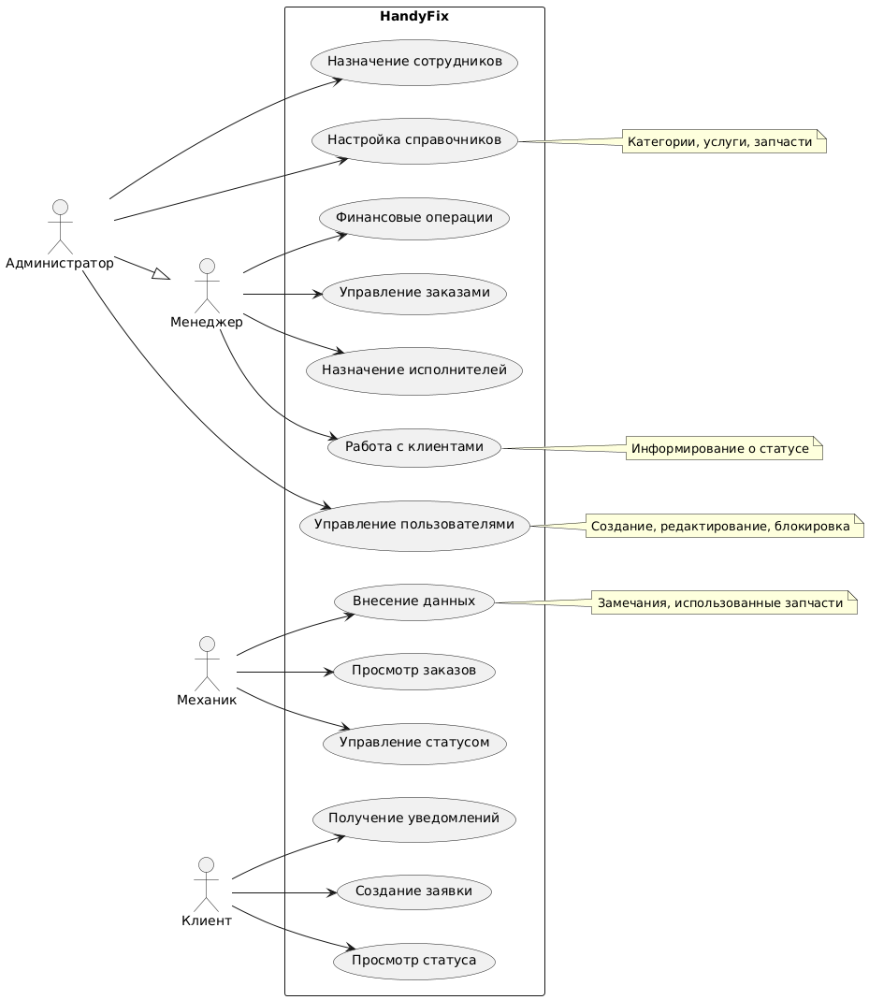

# Министерство высшего образования и науки Российской Федерации  
## ФГБОУ ВО «Кубанский государственный технологический университет»  
### Институт компьютерных систем и информационной безопасности  
#### Кафедра информатики и вычислительной техники  

---

# ЛАБОРАТОРНАЯ РАБОТА  
**по дисциплине «Базы данных»**

---

**Выполнил студент группы 23-КБ-ПР2:**  
Фролов Андрей Андреевич  

**Руководитель работы:**  
Киянов Илья Русланович  

---

2025 г.

---

### 11 вариант.  
**Тема:** Ремонтная мастерская: виды работ, исполнители, заказы на ремонт, заказчики.  

---

## Лабораторная работа №1  
**Тема:** Анализ предметной области  

**Цель:** изучение бизнес-процесса и информационных потоков, имеющих место в заданной предметной области, освоение средств моделирования предметной области в виде инфологической модели данных и базовых моделей UML.  

---

### Задание:
1. Изучить заданный массив входной информации (приложение А): структурировать его по ключевым сущностям с указанием всех атрибутов.  
2. Детально рассмотреть структурированный в п.1 информационный массив и разработать инфологическую модель данных «сущность-связь».  
3. Выделить и описать входные и выходные потоки информации (источники сведений, возможную форму представления, частоту поступления либо обновления, трудоемкость обработки). Составить блок-схему инфопотоков.  
4. Выполнить описание процедур преобразования входных инфопотоков в выходные. Построить базовые диаграммы UML:  
   - Диаграмму вариантов использования – отражать только базовые варианты, число действующих лиц не менее двух;  
   - Диаграмму классов – соблюсти соответствие а) классов-сущностей сущностям модели данных, построенной в п.2, б) граничных классов действующим лицам, заполнять только секции имени и атрибутов.  

Выполнить в табличной форме краткое описание вариантов использования и классов, разработанных в п.4.  

В отчет включить: структурированный массив входной информации, описания инфопотоков и процедур их преобразования, построенные схемы и модели с описанием, выводы по работе.  

---

### Выполнение работы:

#### ERD - диаграмма:  

---

### Модель информационных потоков:

#### Таблица 1 – Реестр входных информационных потоков

| Наименование и назначение потока | Форма представления         | Обработчик       | Корреспондент | Трудозатраты | Периодичность регламент                         |
|----------------------------------|-----------------------------|------------------|---------------|--------------|------------------------------------------------|
| Заявка на ремонт                 | Форма на сайте | Механик           | Заказчик      | 0.5 - 2 чел·ч | Заявки обрабатываются по мере поступления, с ежедневной проверкой статуса. |
| Данные исполнителей              | Форма на сайте | Администратор    | Администратор | 0.2 - 1 чел·ч | Еженедельная проверка актуальности информации для обеспечения ее точности и соответствия требованиям. |
| Внешние источники данных         | XML/JSON                   | Специалист по интеграции данных | Внешние системы | 1 - 3 чел·ч | Регулярное обновление данных |

---

#### Таблица 2 – Реестр выходных информационных потоков

| Наименование и назначение потока | Форма представления         | Обработчик      | Корреспондент | Трудозатраты | Периодичность регламент          |
|----------------------------------|-----------------------------|-----------------|---------------|--------------|-----------------------------------|
| Список выполненных работ         | Таблица на сайте        | Администратор   | Заказчик     | 2 - 5 чел·ч | Обновление списка работ происходит регулярно |
| Список доступных услуг           | Таблица на сайте        | Администратор   | Заказчик     | 3 - 6 чел·ч | Обновление списка услуг происходит регулярно |
| Список исполнителей             | Таблица на сайте        | Администратор   | Механик       | 2 - 4 чел·ч | Обновление списка исполнителей происходит регулярно |

---

#### Рис. № 2 - модель информационных потоков

---

### Диаграмма вариантов использования (use case):

---

#### Таблица 3 – Краткое описание вариантов использования

| Актёр           | Вариант использования               | Описание                                                                 |
|------------------|-------------------------------------|-------------------------------------------------------------------------|
| Администратор   | Управление пользователями          | Администратор может создавать, редактировать и блокировать пользователей. |
| Администратор   | Назначение сотрудников             | Администратор может назначать роли сотрудникам.                         |
| Администратор   | Настройка справочников             | Администратор может управлять категориями, услугами и запчастями.       |
| Менеджер        | Управление заказами                | Менеджер может просматривать, добавлять и редактировать заказы.         |
| Менеджер        | Назначение исполнителей            | Менеджер может назначать механиков на выполнение заказов.               |
| Менеджер        | Работа с клиентами                 | Менеджер информирует клиентов о статусе их заказов.                     |
| Менеджер        | Финансовые операции                | Менеджер может выполнять финансовые операции, связанные с заказами.     |
| Механик         | Просмотр заказов                   | Механик может просматривать список своих текущих заказов.               |
| Механик         | Управление статусом                | Механик может обновлять статус выполнения заказа.                      |
| Механик         | Внесение данных                    | Механик может вносить данные о замечаниях и использованных запчастях.  |
| Клиент          | Создание заявки                   | Клиент может создавать новые заявки на ремонт.                         |
| Клиент          | Просмотр статуса                   | Клиент может проверять статус своей заявки.                            |
| Клиент          | Получение уведомлений              | Клиент получает уведомления о важных изменениях в статусе заявки.       |

### Вывод:
Научился делать модели - ERD, UseCase и информационных потоков и изучил бизнес-процесс и информационные потоки.