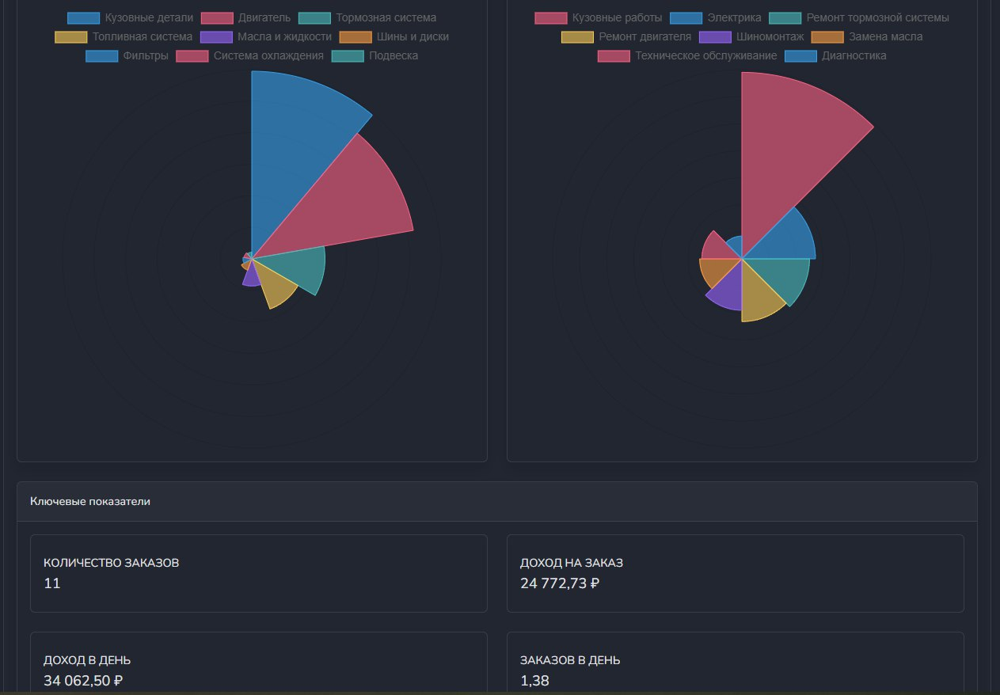
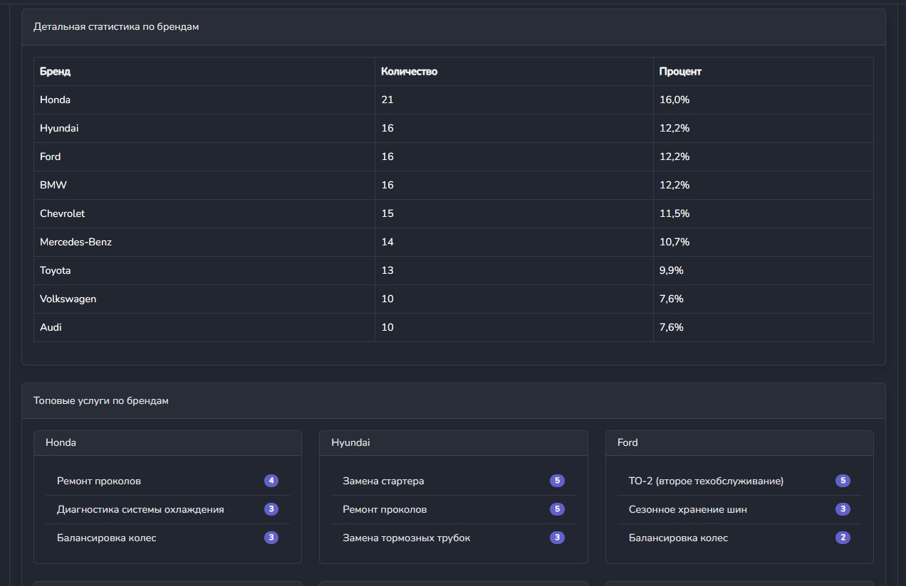

# Министерство высшего образования и науки Российской Федерации
## ФГБОУ ВО «Кубанский государственный технологический университет»
### Институт компьютерных систем и информационной безопасности
#### Кафедра информатики и вычислительной техники

---

# ЛАБОРАТОРНАЯ РАБОТА №10
**по дисциплине «Базы данных»**

---

**Выполнил студент группы 23-КБ-ПР2:**  
Фролов Андрей Андреевич

**Руководитель работы:**  
Киянов Илья Русланович

---

2025 г.

---

**Цель работы:**
Программирование экспорта данных из БД.

**Задания для самостоятельной работы:**

1. **На основе приложения, разработанного при выполнении лабораторных работ №8 и №9, создать форму для обеспечения доступа к результатным данным и их экспорта в Excel и HTML. Созданную форму связать с соответствующим пунктом меню «Экспорт» главной формы приложения.**

2. **Посредством интерфейсных средств приложения обеспечить ввод в БД разнообразных данных, достаточных для тестирования операций экспорта результатных инфопотоков.**

3. **Выполнить пользовательское тестирование операций экспорта и убедиться в соответствии полученных результатов потребностям пользователей.**

## Ход работы:

### Задание 1.

Описание принципа работы финансовой статистики:

Финансовая статистика рассчитывается на основе данных из таблиц заказов, услуг и товаров. Учитываются только выполненные заказы (статус is_closing = true). Основные показатели:
- Общий доход (сумма выполненных заказов)
- Доход от услуг (сумма всех услуг в заказах)
- Доход от товаров (сумма всех товаров в заказах)
- Средний чек
- Количество заказов

Дополнительные метрики включают:
- Динамика дохода по дням
- Распределение по категориям товаров
- Распределение по типам услуг
- Средние показатели (доход на заказ, доход в день)

Пользователь может выбрать период анализа (по умолчанию - последние 30 дней). Данные визуализируются с помощью графиков и диаграмм.

### Задание 2.

Форма для добавления данных в таблицу услуг. Результат на рисунке 2.

### Задание 3.

Описание принципа работы статистики автомобилей:

Статистика автомобилей анализирует данные из таблиц транспортных средств, заказов и моделей автомобилей. Основные показатели:
- Количество автомобилей по брендам
- Распределение по годам выпуска
- Общее количество автомобилей
- Среднее количество заказов на один автомобиль

Дополнительные метрики включают:
- Топовые услуги для каждого бренда
- Популярность моделей
- Статистика по типам кузова
- Распределение по регионам

Данные визуализируются с помощью:
- Круговых диаграмм для распределения по брендам
- Столбчатых диаграмм для статистики по годам
- Радарных диаграмм для анализа услуг по брендам
Тестирование экспорта данных представлено на рисунке 3.

В ходе тестирования было установлено, что полученные результаты соответствуют потребностям пользователей.