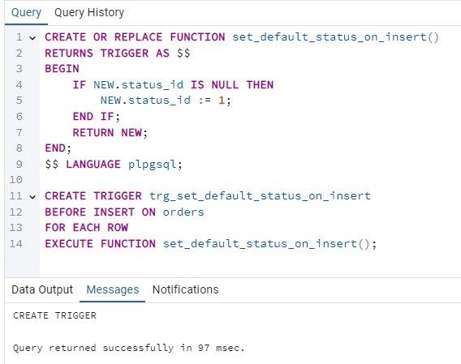
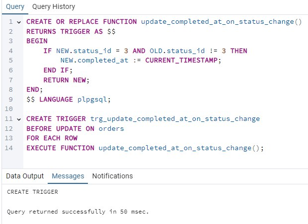
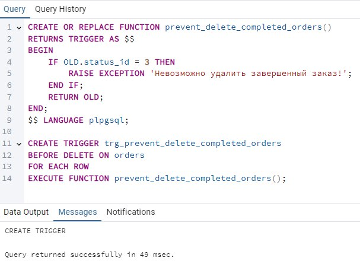
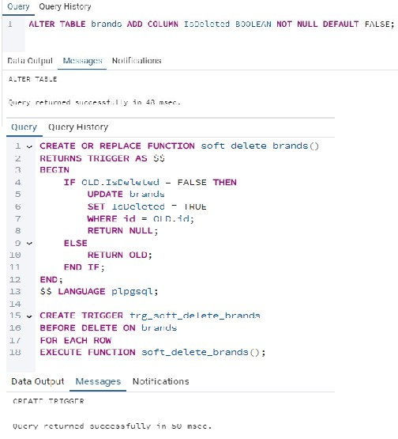
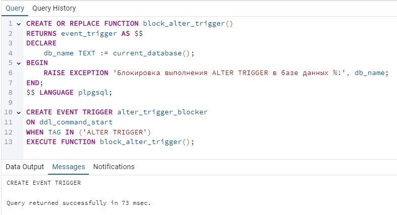
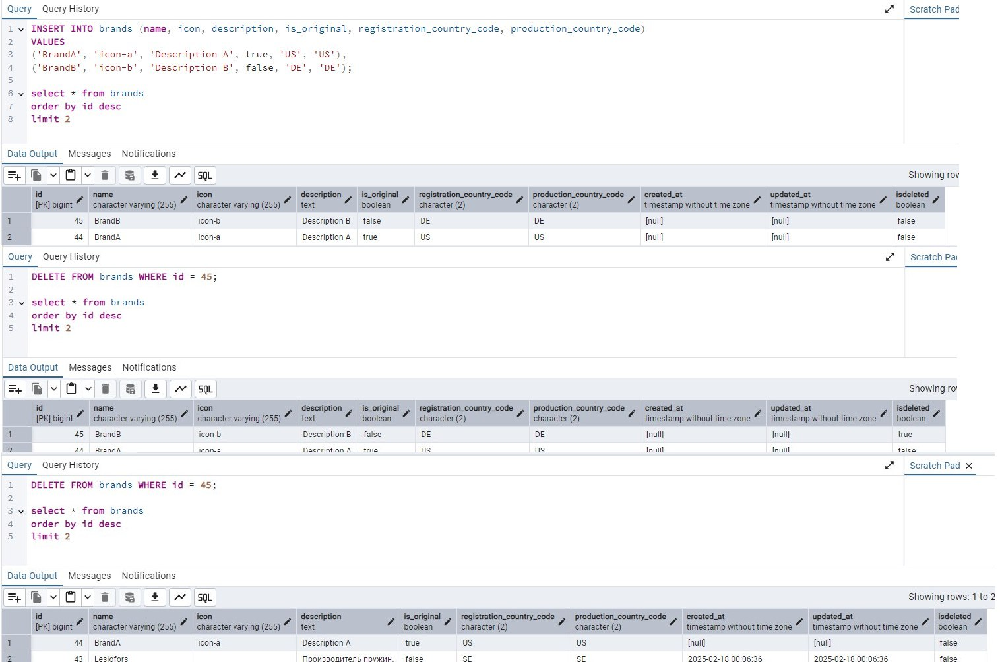
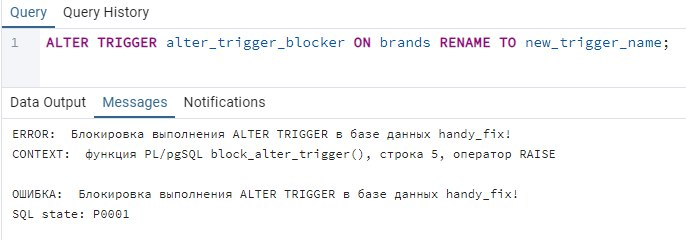
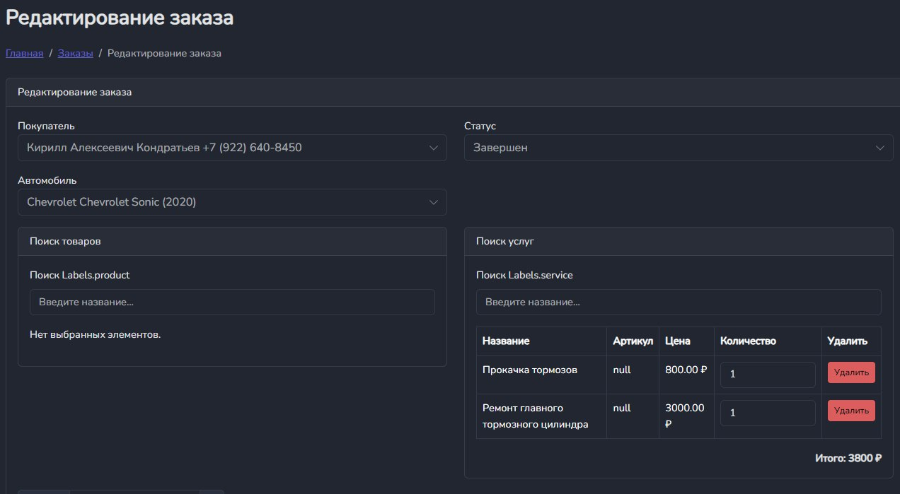

# Министерство высшего образования и науки Российской Федерации
## ФГБОУ ВО «Кубанский государственный технологический университет»
### Институт компьютерных систем и информационной безопасности
#### Кафедра информатики и вычислительной техники

---

# ЛАБОРАТОРНАЯ РАБОТА №11
**по дисциплине «Базы данных»**

---

**Выполнил студент группы 23-КБ-ПР2:**  
Фролов Андрей Андреевич

**Руководитель работы:**  
Киянов Илья Русланович

---

2025 г.

---

**Цель работы:**
Получить практические навыки реализации специфических ограничений определения структур данных и манипулирования данными при помощи триггеров.

**Задания для самостоятельной работы:**

1. **Проанализировать схему базы данных, разработанной при выполнении лабораторных работ №5 и №6, и определить для отслеживания несколько DML-событий, не менее 1 события каждого типа.**

2. **Для определенных в п.1 событий разработать команды SQL для создания соответствующих DML-триггеров типов BEFORE. Выполнить команды и убедиться в корректности их выполнения.**

3. **В соответствии с индивидуальным заданием согласно табл. 11.1 создать DML-триггеры типа AFTER для логирования манипуляций с оперативными данными БД. Для этого создать таблицу logs, в которой определить поле date, где будет записываться дата и время (timestamp) срабатывания триггера, и поле info, где будет записываться информация о вызванной команде.**

4. **Добавить в любой из справочников БД поле IsDeleted типа Boolean (по умолчанию false) и создать для этого справочника DML-триггер для реализации мягкого удаления данных - при выполнении удаления, для тех строк, где IsDeleted стоит false триггер устанавливает это поле как true, вместо того чтобы их удалить, а при повторном вызове уже удаляет.**

5. **В соответствии с индивидуальными заданием согласно табл. 11.1 разработать DDL-триггер (event trigger) для блокировки в БД DDL-событий. Предусмотреть вывод сообщения о блокировке, содержащего имя БД.**

6. **Выполнить тестирование разработанных в пп. 2–5 триггеров посредством инициирования в БД соответствующих событий. Зафиксировать результаты срабатывания триггеров скриншотами.**

7. **Доработать приложение, разработанное при выполнении лабораторных работ №9 и №10, обеспечить правильную обработку исключений при получении ошибок от срабатывания триггеров.**

## Ход работы:

### Задания 1-3.

### **Триггер `set_default_status_on_insert`**
Триггер активируется перед вставкой новой записи в таблицу `orders`. Если поле `status_id` не указано (равно `NULL`), триггер автоматически устанавливает значение `status_id` в `1`, что соответствует статусу "новый". Это гарантирует, что каждый новый заказ имеет корректный начальный статус.

---

### 

---

### **Триггер `prevent_delete_completed_orders`**
Триггер активируется перед удалением записи из таблицы `orders`. Если статус заказа равен `3` (статус "завершен"), триггер предотвращает удаление записи, выбрасывая исключение с сообщением: `"Невозможно удалить завершенный заказ!"`. Это защищает данные от случайного или некорректного удаления завершенных заказов.

---

**Триггер `set_default_status_on_insert`**
Триггер активируется перед вставкой новой записи в таблицу `orders`. Если поле `status_id` не указано (равно `NULL`), триггер автоматически устанавливает значение `status_id` в `1`, что соответствует статусу "новый". Это гарантирует, что каждый новый заказ имеет корректный начальный статус.

**Триггер `update_completed_at_on_status_change`**
Триггер срабатывает перед обновлением записи в таблице `orders`. Если статус заказа (`status_id`) меняется на значение `3` (статус "завершен"), триггер автоматически заполняет поле `completed_at` текущей датой и временем. Это позволяет точно отслеживать момент завершения заказа.

**Триггер `prevent_delete_completed_orders`**
Триггер активируется перед удалением записи из таблицы `orders`. Если статус заказа равен `3` (статус "завершен"), триггер предотвращает удаление записи, выбрасывая исключение с сообщением: `"Невозможно удалить завершенный заказ!"`. Это защищает данные от случайного или некорректного удаления завершенных заказов.

### Задание 4.

Создание поля `is_deleted` для таблицы `books`, добавление триггера на мягкое удаление, чтобы при удалении сначала флаг `is_delete` становился `true`, а если он уже `true`, то производить полное удаление записи. Результат на рисунке 4.

### Задание 5.

Разработка DDL-триггера (event trigger) для блокировки в БД DDL-события - `UPDATE DROP_VIEW`. Предусмотрен вывод сообщения о блокировке, содержащего имя БД. Результат на рисунке 5.

### Задание 6.

Тестирование разработанных в пп. 2–5 триггеров посредством инициирования в БД соответствующих событий. Результат на рисунке 6-7.

---

### Задание 7.

Доработка приложения на правильную обработку триггеров. При указании у заказа статуса «Завершён» книги списываются со склада в указанном в заказе количестве. Результат на рисунке 8.

---

## Вопросы:

1. **Что такое триггер?**

   Триггер — это специальная процедура (функция), которая автоматически выполняется в ответ на определенные события в базе данных. Триггеры используются для реализации бизнес-логики, обеспечения целостности данных и выполнения дополнительных действий при изменении данных или структуры базы.

2. **Какие бывают фазы срабатывания триггера?**

   Триггеры могут срабатывать на двух фазах:

   - **BEFORE** — до выполнения основного события (например, вставки, обновления или удаления данных).
   - **AFTER** — после выполнения основного события.

3. **Какова разница между триггерами различных фаз срабатывания?**

   - **BEFORE**:
     - Выполняется до того, как изменения будут применены к базе данных.
     - Используется для проверки или модификации входных данных перед их сохранением.
     - Может предотвратить выполнение операции, если данные не соответствуют заданным условиям.
   - **AFTER**:
     - Выполняется после того, как изменения уже были применены к базе данных.
     - Используется для выполнения дополнительных действий на основе измененных данных.
     - Не может изменять данные, так как они уже сохранены.

4. **Каково назначение DML-триггера?**

   DML-триггеры (Data Manipulation Language) предназначены для реагирования на события, связанные с манипуляцией данными:

   - Вставка (`INSERT`),
   - Обновление (`UPDATE`),
   - Удаление (`DELETE`).

   Они позволяют выполнять автоматические действия, такие как:

   - Проверка корректности данных,
   - Обновление связанных таблиц,
   - Логирование изменений,
   - Реализация сложной бизнес-логики.

5. **Охарактеризовать события DML-триггера.**

   Событиями DML-триггера являются операции, которые изменяют данные в таблицах:

   - `INSERT`: Срабатывает при добавлении новых записей.
   - `UPDATE`: Срабатывает при изменении существующих записей.
   - `DELETE`: Срабатывает при удалении записей.

   Каждое событие может быть связано с одной или несколькими фазами срабатывания (`BEFORE`, `AFTER`).

6. **Каково назначение DDL-триггера?**

   DDL-триггеры (Data Definition Language) предназначены для реагирования на события, связанные с изменением структуры базы данных:

   - Создание, изменение или удаление таблиц (`CREATE TABLE`, `ALTER TABLE`, `DROP TABLE`),
   - Создание или удаление представлений (`CREATE VIEW`, `DROP VIEW`),
   - Изменение индексов, триггеров или других объектов.

   Они используются для:

   - Блокировки нежелательных изменений структуры базы данных,
   - Логирования изменений схемы,
   - Автоматического выполнения действий при изменении структуры.

7. **Какие объекты доступны в триггерных функциях?**

   В триггерных функциях доступны следующие специальные объекты:

   - `OLD`: Содержит старые значения строки (доступно для операций `UPDATE` и `DELETE`).
   - `NEW`: Содержит новые значения строки (доступно для операций `INSERT` и `UPDATE`).
   - `TG_NAME`: Имя триггера.
   - `TG_WHEN`: Фаза срабатывания триггера (`BEFORE` или `AFTER`).
   - `TG_LEVEL`: Уровень триггера (`ROW` или `STATEMENT`).
   - `TG_OP`: Тип операции, вызвавшей триггер (`INSERT`, `UPDATE`, `DELETE`).
   - `TG_TABLE_NAME`: Имя таблицы, к которой привязан триггер.
   - `TG_ARGV`: Массив аргументов, переданных триггеру.

   Эти объекты позволяют триггеру анализировать контекст события и выполнять необходимые действия.
