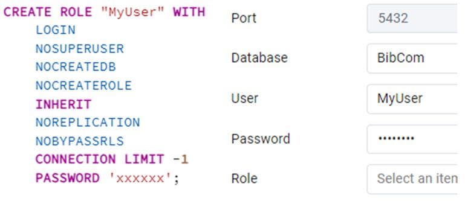
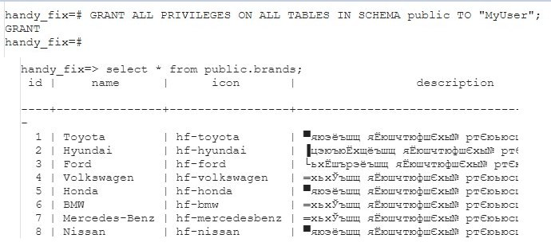
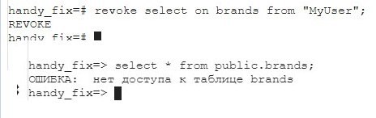
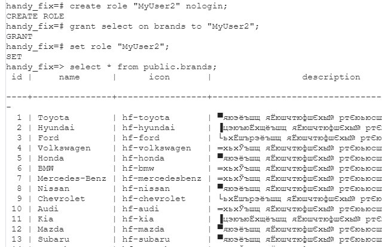

# Министерство высшего образования и науки Российской Федерации
## ФГБОУ ВО «Кубанский государственный технологический университет»
### Институт компьютерных систем и информационной безопасности
#### Кафедра информатики и вычислительной техники

---

# ЛАБОРАТОРНАЯ РАБОТА №10
**по дисциплине «Базы данных»**

---

**Выполнил студент группы 23-КБ-ПР2:**  
Фролов Андрей Андреевич

**Руководитель работы:**  
Киянов Илья Русланович

---

2025 г.

---

**Цель работы:**
Получить практические навыки создания групп пользователей и изменения прав доступа для них.

**Задания для самостоятельной работы:**

**Задание 1.** Используя pgAdmin4, создать новую роль пользователей MyUser. Опции: Лимит подключений 1, разрешить логин. Зайти под этим логином через консоль psql.

**Задание 2.** Выдать права на все таблицы в схеме public. Выполнить для них SELECT в консоли psql. Убедиться в работоспособности роли.

**Задание 3.** Отозвать права на одну из таблиц. Выполнить для неё SELECT в консоли psql. Убедиться в невозможности выполнения запроса.

**Задание 4.** Создать роль без прав с названием MyUser2 и в соответствии с индивидуальными заданием согласно табл. 12.1 выдать права на необходимые действия для этой роли. Проверить работоспособность запросов.

## Ход работы:

### Задание 1.

Создана роль MyUser с паролем password и произведён логин под этим пользователем. Результат на рисунке 1.

### Задание 2.

Выданы права на новую роль, проверена работоспособность. Результат на рисунке 2.

### Задание 3.

Отозваны права на таблицу брендов. Результат на рисунке 3.

### Задание 4.

Создана роль без прав MyUser2 и выданы права на SELECT для таблицы брендов. Результат на рисунке 4.

