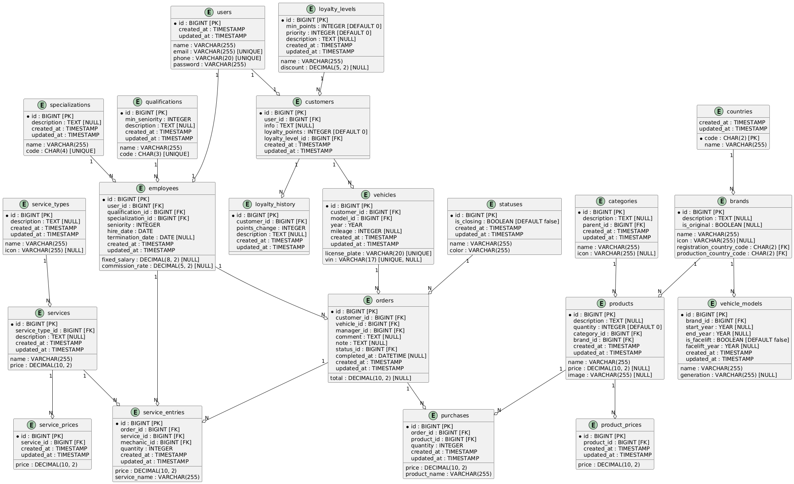

# Министерство высшего образования и науки Российской Федерации
## ФГБОУ ВО «Кубанский государственный технологический университет»
### Институт компьютерных систем и информационной безопасности
#### Кафедра информатики и вычислительной техники

---

# ЛАБОРАТОРНАЯ РАБОТА №2
**по дисциплине «Базы данных»**

---

**Выполнил студент группы 23-КБ-ПР2:**  
Фролов Андрей Андреевич

**Руководитель работы:**  
Киянов Илья Русланович

---

2025 г.

---

### Цель работы:
Изучение принципов и инструментов проектирования реляционной базы данных, освоение средств моделирования предметной области в виде даталогической модели.

---

### Задания для самостоятельной работы:

#### Задание 1.
На основе анализа предметной области, проведенного при выполнении лабораторной работы №1, произвести идентификацию сущностей базы данных и связей между ними:
- Изучить массив нормативно-справочной (условно-постоянной) информации, определить состав соответствующих справочников.
- Изучить массив входной (текущей) информации, структурировать его по ключевым сущностям с указанием всех атрибутов.  
  Количество сущностей зависит от предметной области.

#### Задание 2.
При помощи выбранного CASE-средства разработать ER-диаграмму логической модели данных. Отсортировать сущности на справочные и оперативные.

#### Задание 3.
Провести нормализацию сущностей логической модели данных. Для каждой сущности представить логическую схему нормализации.

#### Задание 4.
Разработать ER-диаграмму физической модели данных. Описание сущностей физической модели данных привести по технологии, изложенной в п.2. Цель физического моделирования – это таблицы в нормальных формах высшего, минимум, третьего (НФ3) порядка.

#### Задание 5.
Выполнить описание таблиц физической модели БД.

#### Задание 6.
Выполнить описание связей в физической модели БД и условия целостности данных.

---

### Ход работы

#### Задание 1. Идентификация сущностей и связей

**Сущности:**

- **Справочные сущности:**
    - Countries (Страны)
    - Brands (Бренды)
    - LoyaltyLevels (Уровни лояльности)
    - Specializations (Специализации)
    - Qualifications (Квалификации)
    - Statuses (Статусы)
    - ServiceTypes (Типы услуг)
    - Categories (Категории)

- **Оперативные сущности:**
    - Users (Пользователи)
    - Customers (Клиенты)
    - VehicleModels (Модели транспортных средств)
    - Vehicles (Транспортные средства)
    - Employees (Сотрудники)
    - Orders (Заказы)
    - Services (Услуги)
    - ServiceEntries (Записи об услугах)
    - LoyaltyHistory (История лояльности)
    - Products (Продукты)
    - Purchases (Покупки)
    - ProductPrices (Цены продуктов)
    - ServicePrices (Цены услуг)

---

#### Задание 2. ER-диаграмма логической модели данных

**Таблица 2.1 — Сущности даталогической модели реляционной БД**
# Таблица 2.1 - Сущности даталогической модели реляционной БД

| № | Сущность           | Атрибуты                                                                                     | Описание                                                                 |
|---|--------------------|----------------------------------------------------------------------------------------------|--------------------------------------------------------------------------|
| **Справочные**         | **Справочные**                                                                               | **Справочные**                                                           | **Справочные**                                                           |
| 1 | Роли               | ID, Name                                                                                    | Информация о ролях пользователей системы (например, администратор, клиент, механик). |
| 2 | Страны             | Code (CHAR(2)), Name                                                                        | Список стран для регистрации или производства брендов.                  |
| 3 | Бренды             | ID, Name, Icon, Description, IsOriginal, RegistrationCountryCode, ProductionCountryCode     | Информация о производителях автозапчастей и автомобилей.                 |
| 4 | Категории услуг    | ID, Name, Icon, Description                                                                 | Категории выполняемых в автосервисе работ.                               |
| 5 | Уровни лояльности  | ID, Name, MinPoints, Discount, Priority, Description                                        | Система лояльности для клиентов на основе накопленных баллов.            |
| 6 | Модели автомобилей | ID, BrandID, Name, Generation, StartYear, EndYear, IsFacelift, FaceliftYear                | Информация о моделях автомобилей.                                        |
| 7 | Специализации      | ID, Name, Code, Description                                                                 | Специализации сотрудников (например, механик по двигателям).             |
| 8 | Квалификации       | ID, Name, MinSeniority, Code, Description                                                  | Квалификационные уровни сотрудников.                                     |
| 9 | Статусы заказов    | ID, Name, Color, IsClosing                                                                  | Статусы выполнения заказов (например, "В работе", "Завершен").           |

| № | Сущность           | Атрибуты                                                                                     | Описание                                                                 |
|---|--------------------|----------------------------------------------------------------------------------------------|--------------------------------------------------------------------------|
| **Оперативные**        | **Оперативные**                                                                              | **Оперативные**                                                          | **Оперативные**                                                          |
| 10| Пользователи       | ID, Name, Email, Phone, Password, RoleID                                                    | Информация о пользователях системы.                                      |
| 11| Клиенты            | ID, UserID, Info, LoyaltyPoints, LoyaltyLevelID                                             | Информация о клиентах автосервиса.                                       |
| 12| Автомобили         | ID, CustomerID, ModelID, Year, LicensePlate, VIN, Mileage                                   | Информация об автомобилях клиентов.                                      |
| 13| Заказы             | ID, CustomerID, VehicleID, ManagerID, Total, Comment, Note, StatusID, CompletedAt          | Информация о заказах клиентов.                                          |
| 14| Услуги             | ID, ServiceTypeID, Name, Description, Price                                                 | Перечень предоставляемых услуг.                                          |
| 15| Строки услуг       | ID, OrderID, ServiceID, MechanicID, Price, Quantity, ServiceName                            | Детали услуг, входящих в заказ.                                          |
| 16| Продукты           | ID, Name, Description, Price, Quantity, Image, CategoryID, BrandID                          | Информация о товарах, доступных в автосервисе.                           |
| 17| Покупки            | ID, OrderID, ProductID, Price, Quantity, ProductName                                         | Информация о покупках товаров в рамках заказа.                           |
| 18| История лояльности | ID, CustomerID, PointsChange, Description                                                   | История начисления/списания баллов лояльности для клиентов.              |
| 19| Сотрудники         | ID, UserID, QualificationID, SpecializationID, FixedSalary, CommissionRate, Seniority, HireDate, TerminationDate | Информация о сотрудниках автосервиса.                                    |

---

#### Задание 3. Нормализация

Структура базы данных была разработана с учетом принципов нормализации и соответствует требованиям третьей нормальной формы (3НФ):

1. Все атрибуты имеют простые значения, что удовлетворяет требованиям 1НФ.
2. Частичные зависимости устранены за счет выделения справочных сущностей (например, `Countries`, `Brands`, `LoyaltyLevels`), что обеспечивает соответствие 2НФ.
3. Транзитивные зависимости отсутствуют благодаря четкому разделению данных между таблицами, что гарантирует соответствие 3НФ.

---

#### Задание 4. ER-диаграмма физической модели данных

---

#### Задание 5. Описание таблиц физической модели БД

**Таблица 1: Заказы (Orders)**

| Имя поля         | Тип данных     | Размер   | Условие на значение       | Значение по умолчанию | Примечание               |
|------------------|---------------|----------|---------------------------|-----------------------|--------------------------|
| ID               | bigint        |          | NOT NULL                  |                       | Первичный ключ           |
| customer_id      | bigint        |          | NOT NULL                  |                       | Внешний ключ (Customers) |
| vehicle_id       | bigint        |          | NOT NULL                  |                       | Внешний ключ (Vehicles)  |
| manager_id       | bigint        |          | NULL                      |                       | Внешний ключ (Employees) |
| total            | decimal(10,2) |          | NULL                      |                       |                          |
| comment          | text          |          | NULL                      |                       |                          |
| note             | text          |          | NULL                      |                       |                          |
| status_id        | bigint        |          | NOT NULL                  |                       | Внешний ключ (Statuses)  |
| completed_at     | datetime      |          | NULL                      |                       |                          |
| created_at       | timestamp     |          | NOT NULL                  | CURRENT_TIMESTAMP     |                          |
| updated_at       | timestamp     |          | NOT NULL                  | CURRENT_TIMESTAMP     |                          |

---

**Таблица 2: Товары (Products)**

| Имя поля         | Тип данных     | Размер   | Условие на значение       | Значение по умолчанию | Примечание               |
|------------------|---------------|----------|---------------------------|-----------------------|--------------------------|
| ID               | bigint        |          | NOT NULL                  |                       | Первичный ключ           |
| name             | varchar(255)  |          | NOT NULL                  |                       |                          |
| description      | text          |          | NULL                      |                       |                          |
| price            | decimal(10,2) |          | NULL                      |                       |                          |
| quantity         | int           |          | NOT NULL                  | 0                     |                          |
| image            | varchar(255)  |          | NULL                      |                       |                          |
| category_id      | bigint        |          | NOT NULL                  |                       | Внешний ключ (Categories)|
| brand_id         | bigint        |          | NOT NULL                  |                       | Внешний ключ (Brands)    |
| created_at       | timestamp     |          | NOT NULL                  | CURRENT_TIMESTAMP     |                          |
| updated_at       | timestamp     |          | NOT NULL                  | CURRENT_TIMESTAMP     |                          |

---

**Таблица 3: Клиенты (Customers)**

| Имя поля         | Тип данных     | Размер   | Условие на значение       | Значение по умолчанию | Примечание               |
|------------------|---------------|----------|---------------------------|-----------------------|--------------------------|
| ID               | bigint        |          | NOT NULL                  |                       | Первичный ключ           |
| user_id          | bigint        |          | NOT NULL                  |                       | Внешний ключ (Users)     |
| info             | text          |          | NULL                      |                       |                          |
| loyalty_points   | int           |          | NOT NULL                  | 0                     |                          |
| loyalty_level_id | bigint        |          | NULL                      |                       | Внешний ключ (LoyaltyLevels) |
| created_at       | timestamp     |          | NOT NULL                  | CURRENT_TIMESTAMP     |                          |
| updated_at       | timestamp     |          | NOT NULL                  | CURRENT_TIMESTAMP     |                          |

---

**Таблица 4: Сотрудники (Employees)**

| Имя поля              | Тип данных     | Размер   | Условие на значение       | Значение по умолчанию | Примечание               |
|-----------------------|---------------|----------|---------------------------|-----------------------|--------------------------|
| ID                    | bigint        |          | NOT NULL                  |                       | Первичный ключ           |
| user_id               | bigint        |          | NULL                      |                       | Внешний ключ (Users)     |
| qualification_id      | bigint        |          | NULL                      |                       | Внешний ключ (Qualifications) |
| specialization_id     | bigint        |          | NULL                      |                       | Внешний ключ (Specializations) |
| fixed_salary          | decimal(8,2)  |          | NULL                      |                       |                          |
| commission_rate       | decimal(5,2)  |          | NULL                      |                       |                          |
| seniority             | int           |          | NOT NULL                  |                       |                          |
| hire_date             | date          |          | NOT NULL                  |                       |                          |
| termination_date      | date          |          | NULL                      |                       |                          |
| created_at            | timestamp     |          | NOT NULL                  | CURRENT_TIMESTAMP     |                          |
| updated_at            | timestamp     |          | NOT NULL                  | CURRENT_TIMESTAMP     |                          |

---

#### Задание 6. Описание связей в физической модели БД

**Таблица 2.3 — Связи между таблицами БД**

| Родительская таблица | Атрибут        | Дочерняя таблица | Атрибут        | Тип связи |
|-----------------------|----------------|------------------|----------------|-----------|
| Countries            | Code           | Brands           | RegistrationCountryCode | 1:M       |
| Countries            | Code           | Brands           | ProductionCountryCode   | 1:M       |
| Users                | ID             | Customers        | UserID                | 1:M       |
| Users                | ID             | Employees        | UserID                | 1:M       |
| VehicleModels        | ID             | Vehicles         | ModelID               | 1:M       |
| Customers            | ID             | Vehicles         | CustomerID            | 1:M       |
| Orders               | ID             | ServiceEntries   | OrderID               | 1:M       |
| Services             | ID             | ServiceEntries   | ServiceID             | 1:M       |
| Employees            | ID             | ServiceEntries   | MechanicID            | 1:M       |
| Orders               | ID             | Purchases        | OrderID               | 1:M       |
| Products             | ID             | Purchases        | ProductID             | 1:M       |

---

### Контрольные вопросы

1. **Дайте понятие отношения в реляционной модели данных.**
   Отношение в реляционной модели данных — это таблица, состоящая из строк и столбцов, где каждая строка представляет запись (кортеж), а каждый столбец — атрибут с определенным типом данных. Каждое отношение имеет уникальное имя, и все записи должны соответствовать заданной структуре. Первичный ключ обеспечивает уникальность записей.

2. **Что такое нормализация отношения? Раскройте смысл данного понятия.**
   Нормализация — это процесс организации данных в базе таким образом, чтобы исключить избыточность и зависимости между атрибутами. Она помогает минимизировать дублирование данных и упростить поддержку БД. Существует несколько нормальных форм (1НФ, 2НФ, 3НФ и т.д.), каждая из которых решает конкретные проблемы в структуре данных.

3. **Чем отличается даталогическое моделирование от инфологического?**
   Даталогическое моделирование фокусируется на структуре данных и их взаимосвязях, используя ER-диаграммы для описания сущностей и связей. Инфологическое моделирование описывает бизнес-процессы и потоки информации, концентрируясь на функциях системы и операциях. Первое больше техническое, второе — функциональное.

4. **Какая нормальная форма является достаточной для промышленной эксплуатации БД и почему?**
   Третья нормальная форма (3НФ) считается достаточной для промышленной эксплуатации, так как она устраняет транзитивные зависимости между атрибутами, что снижает вероятность аномалий при обновлении данных. Это обеспечивает целостность и эффективность работы БД.

5. **Какие типы данных являются приоритетными для создания атрибутов отношений при построении БД?**
   Приоритетными являются числовые типы (`integer`, `bigint`), строковые (`varchar`, `text`), логические (`boolean`) и дата/время (`timestamp`, `date`). Они обеспечивают гибкость и точность представления данных, а также совместимость с большинством СУБД.

6. **Какие типы связей возможны в даталогической модели БД? Поясните смысл связи каждого типа.**
   Основные типы связей:
    - 1:1 (один-к-одному): Один объект связан только с одним другим объектом.
    - 1:N (один-ко-многим): Один объект связан с несколькими другими, но каждый второй объект связан только с одним первым.
    - M:N (многие-ко-многим): Требует промежуточной таблицы для связи нескольких объектов друг с другом.

7. **Что такое ключевой атрибут? Укажите известные вам виды ключей и поясните их назначение.**
   Ключевой атрибут — это поле или набор полей, уникально идентифицирующих запись в таблице. Виды ключей:
    - Первичный ключ (PK): Обеспечивает уникальность записи.
    - Внешний ключ (FK): Устанавливает связь между таблицами.
    - Альтернативный ключ: Используется для дополнительной идентификации.
    - Составной ключ: Создается из нескольких полей для уникальности.

8. **Перечислите известные вам инструментальные программы для даталогического моделирования БД.**
   Инструменты для даталогического моделирования:
    - Lucidchart
    - StarUML
    - dbdiagram.io
    - MySQL Workbench
    - Microsoft Visio
    - Draw.io
    - PlantUML

9. **Для заданной предметной области постройте даталогическую модель данных и выполните её доказательную нормализацию.**
   Пример:
    - Система управления автосервисом:
        - Сущности: Пользователи, Клиенты, Транспортные средства, Заказы, Услуги.
        - Атрибуты:
            - Пользователи: ID, Имя, Email, Пароль.
            - Клиенты: ID, Пользователь_ID, БаллыЛояльности.
            - Транспортные средства: ID, Клиент_ID, Модель_ID, ГодВыпуска.
            - Заказы: ID, Клиент_ID, Статус_ID, Сумма.
            - Услуги: ID, Заказ_ID, Наименование, Цена.
        - Нормализация:
            - 1НФ: Все атрибуты простые.
            - 2НФ: Устранены частичные зависимости (например, выделение справочников).
            - 3НФ: Устранены транзитивные зависимости (например, связь услуг с заказами через промежуточную таблицу).

---
---
---
---
---
---
---
---
---

