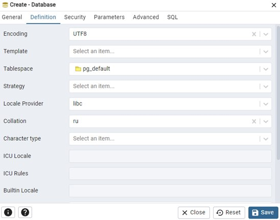
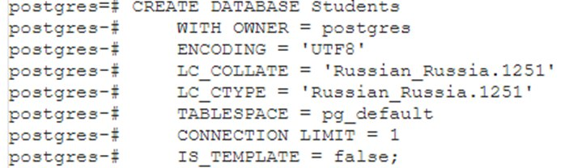
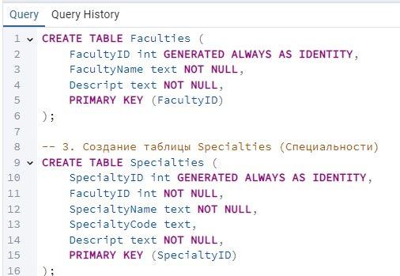
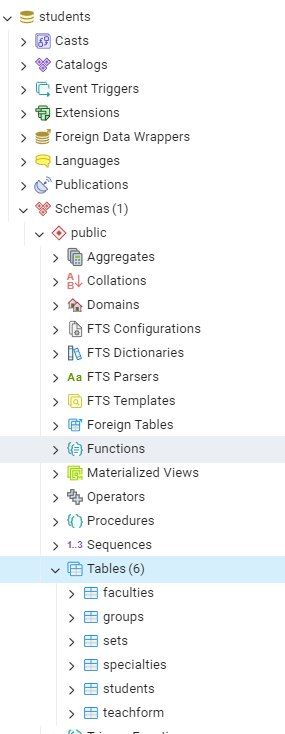
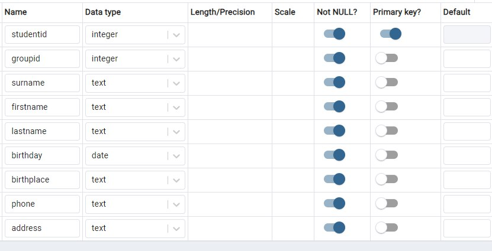
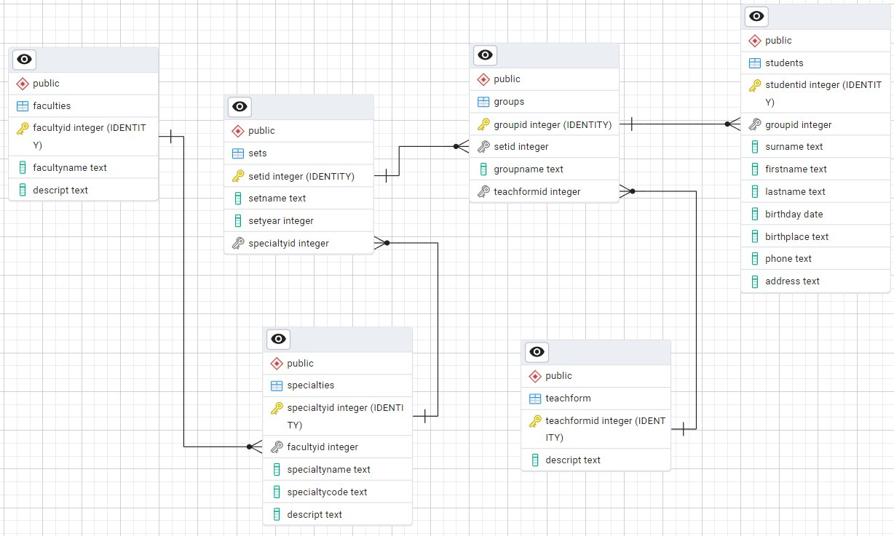
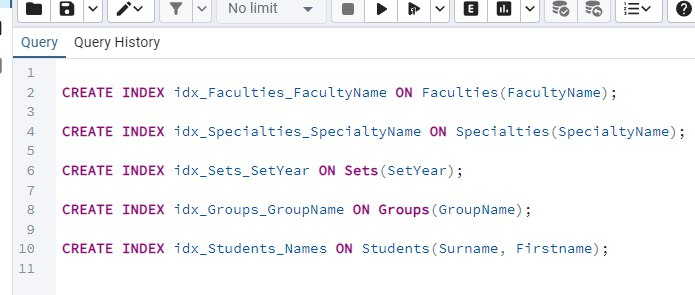
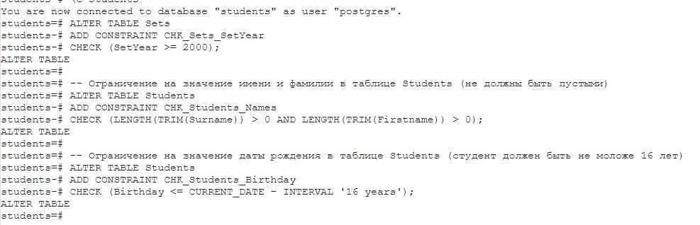
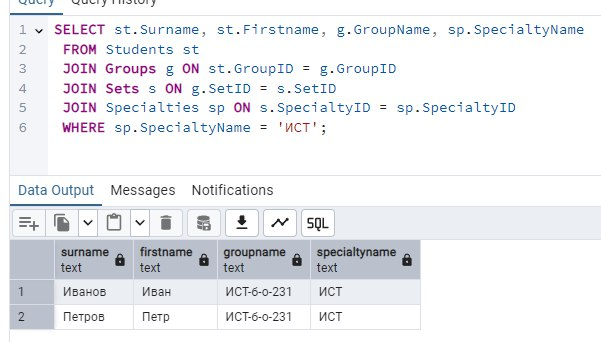

# Министерство высшего образования и науки Российской Федерации
## ФГБОУ ВО «Кубанский государственный технологический университет»
### Институт компьютерных систем и информационной безопасности
#### Кафедра информатики и вычислительной техники

---

# ЛАБОРАТОРНАЯ РАБОТА №3
**по дисциплине «Базы данных»**

---

**Выполнил студент группы 23-КБ-ПР2:**  
Фролов Андрей Андреевич

**Руководитель работы:**  
Киянов Илья Русланович

---

2025 г.

---

### Цель работы:
Освоение инструментальных средств PostgreSQL по созданию и изменению структуры реляционных баз данных, изучение способов создания баз данных и таблиц, применения ключей и индексов, использования свойств полей и типов данных SQL.

---

### Задания для самостоятельной работы:

1. **Задание 1.** При помощи инструментального средства pgAdmin создать базу данных студентов с именем Students.
2. **Задание 2.** Открыть SQL Shell (psql). Подключиться к базе данных postgres на локальном сервере от имени главного пользователя postgres. Составить команду CREATE DATABASE для создания новой БД преподавателей с именем Teachers на основе скопированного кода в пункте 1. Размер кеша 131072. Выполнить запрос и убедиться в корректности его выполнения.
3. **Задание 3.** В pgAdmin открыть Query Tool для разработки структуры БД Teachers.
4. **Задание 4.** В созданный бланк запросов включить SQL-команды CREATE TABLE для создания таблиц №№ 1–4 и 6 соответствующей БД. Сохранить и выполнить запрос, убедиться в корректности его выполнения.
5. **Задание 5.** При помощи конструктора создать в соответствующей БД таблицу Specialities.
6. **Задание 6.** Перейти в SQL Shell (psql), подключиться к своей БД при помощи команды \с имя и выполнить SQL-команды ALTER TABLE для создания первичных и внешних ключей: Teachers. Предусмотреть обеспечение целостности данных. Убедиться в корректности выполнения команд.
7. **Задание 7.** Перейти в PGAdmin и сформировать ER-диаграммы БД. Схема должна выглядеть примерно так, как на рисунке выше.
8. **Задание 8.** Создать разными способами несколько некластерных индексов и ограничений по условию на значение (check constraints).
9. **Задание 9.** Разными способами посредством Query Tool и SQL Shell (psql) составить и выполнить SQL-команды INSERT для добавления данных в таблицы, начиная со справочников, по 2-3 записи в каждую.
10. **Задание 10.** Разными способами посредством Query Tool и SQL Shell (psql) составить и выполнить SQL-команды SELECT ко всем таблицам БД.

---

### Ход работы:

#### Задание 1.
Необходимо создать новую БД с параметрами.



---

#### Задание 2.
Создание БД средствами psql..


---

#### Задание 3.
Переход в pgAdmin Query Tool.



---

#### Задание 4.
Листинг 1 – Бланки сформированных DDL-команд для БД Students

```sql
CREATE TABLE Faculties (
    FacultyID int GENERATED ALWAYS AS IDENTITY,
    FacultyName text NOT NULL,
    Descript text NOT NULL,
    PRIMARY KEY (FacultyID)
);

CREATE TABLE Specialties (
    SpecialtyID int GENERATED ALWAYS AS IDENTITY,
    FacultyID int NOT NULL,
    SpecialtyName text NOT NULL,
    SpecialtyCode text,
    Descript text NOT NULL,
    PRIMARY KEY (SpecialtyID)
);

CREATE TABLE Sets (
    SetID int GENERATED ALWAYS AS IDENTITY,
    SetName text NOT NULL,
    SetYear int NOT NULL,
    SpecialtyID int NOT NULL,
    PRIMARY KEY (SetID)
);

CREATE TABLE TeachForm (
    TeachformID int GENERATED ALWAYS AS IDENTITY,
    Descript text NOT NULL,
    PRIMARY KEY (TeachformID)
);

CREATE TABLE Groups (
    GroupID int GENERATED ALWAYS AS IDENTITY,
    SetID int NOT NULL,
    GroupName text NOT NULL,
    TeachformID int NOT NULL,
    PRIMARY KEY (GroupID)
);

CREATE TABLE Students (
    StudentID int GENERATED ALWAYS AS IDENTITY,
    GroupID int NOT NULL,
    Surname text NOT NULL,
    Firstname text NOT NULL,
    Lastname text NOT NULL,
    Birthday date NOT NULL,
    Birthplace text NOT NULL,
    Phone text NOT NULL,
    Address text NOT NULL,
    PRIMARY KEY (StudentID)
);
```

---

Создание БД средствами psql..



---

#### Задание 5.
Создание таблицы teachers при помощи конструктора.



---

#### Задание 6.
Создание первичных и внешних ключей указано в листинге 2.

Листинг 2 – создание первичных и внешних ключей.

```sql

ALTER TABLE Specialties
ADD CONSTRAINT FK_Specialties_Faculties
FOREIGN KEY (FacultyID) REFERENCES Faculties(FacultyID)
ON UPDATE CASCADE;

ALTER TABLE Sets
ADD CONSTRAINT FK_Sets_Specialties
FOREIGN KEY (SpecialtyID) REFERENCES Specialties(SpecialtyID)
ON UPDATE CASCADE;

ALTER TABLE Groups
ADD CONSTRAINT FK_Groups_Sets
FOREIGN KEY (SetID) REFERENCES Sets(SetID)
ON UPDATE CASCADE
ON DELETE CASCADE;

-- Связь между Groups и TeachForm
ALTER TABLE Groups
ADD CONSTRAINT FK_Groups_TeachForm
FOREIGN KEY (TeachformID) REFERENCES TeachForm(TeachformID)
ON UPDATE CASCADE;

-- Связь между Students и Groups
ALTER TABLE Students
ADD CONSTRAINT FK_Students_Groups
FOREIGN KEY (GroupID) REFERENCES Groups(GroupID)
ON UPDATE CASCADE
ON DELETE CASCADE;
```

Результатирующая диаграмма БД представлена на рисунке 6.



---

#### Задание 8.
Создание кластерных индексов приведено на рисунке 7.



---

Создание ограничений по условию на значение (check constraints) приведено на рисунке 8.



---

#### Задание 9.
Запрос на добавление данных в таблицы представлен в листинге 3.

Листинг 3 – Запрос на добавление записей

```sql
INSERT INTO Faculties (FacultyName, Descript) VALUES
('ФИТ', 'Факультет информационных технологий'),
('ФЭМ', 'Факультет экономики и менеджмента'),
('ФЛФ', 'Факультет лингвистики и филологии');

INSERT INTO Specialties (FacultyID, SpecialtyName, SpecialtyCode, Descript) VALUES
(1, 'ИСТ', '09.03.02', 'Информационные системы и технологии'),
(1, 'ПИ', '09.03.04', 'Программная инженерия'),
(2, 'ЭК', '38.03.01', 'Экономика');

INSERT INTO TeachForm (Descript) VALUES
('Очная'),
('Заочная'),
('Очно-заочная');

INSERT INTO Sets (SetName, SetYear, SpecialtyID) VALUES
('Набор 2023 ИСТ', 2023, 1),
('Набор 2023 ПИ', 2023, 2),
('Набор 2022 ЭК', 2022, 3);

INSERT INTO Groups (SetID, GroupName, TeachformID) VALUES
(1, 'ИСТ-б-о-231', 1),
(2, 'ПИ-б-о-231', 1),
(3, 'ЭК-б-з-221', 2);

INSERT INTO Students (GroupID, Surname, Firstname, Lastname, Birthday, Birthplace, Phone, Address) VALUES
(1, 'Иванов', 'Иван', 'Иванович', '2004-05-15', 'г. Москва', '+7(999)123-45-67', 'г. Москва, ул. Ленина, д. 1, кв. 10'),
(1, 'Петров', 'Петр', 'Петрович', '2003-10-20', 'г. Санкт-Петербург', '+7(999)234-56-78', 'г. Москва, ул. Пушкина, д. 2, кв. 20'),
(2, 'Сидорова', 'Мария', 'Ивановна', '2004-08-12', 'г. Новосибирск', '+7(999)345-67-89', 'г. Москва, ул. Гагарина, д. 3, кв. 30');
```

---

#### Задание 10.
Результат выполнения SELECT запроса.



---


# Контрольные вопросы по PostgreSQL

## 1. Определение СУБД PostgreSQL. Объекты PostgreSQL. Подмножества языка SQL-DDL и SQL-DML.
PostgreSQL — это объектно-реляционная система управления базами данных (СУБД) с открытым исходным кодом. Она поддерживает ACID-транзакции, расширяемость, сложные запросы и репликацию.

### Основные объекты PostgreSQL:
- **Базы данных** — контейнеры для хранения данных.
- **Таблицы** — структуры, содержащие строки и столбцы.
- **Просмотры (views)** — виртуальные таблицы на основе запросов.
- **Функции и процедуры** — блоки кода для выполнения операций.
- **Индексы** — структуры для ускорения поиска данных.

### Подмножества SQL:
- **DDL (Data Definition Language)** — определяет структуру данных: `CREATE`, `ALTER`, `DROP`.
- **DML (Data Manipulation Language)** — изменяет данные: `INSERT`, `UPDATE`, `DELETE`, `SELECT`.

## 2. Понятие базы данных в СУБД PostgreSQL. Особенности создания и физической организации БД.
База данных в PostgreSQL — это логическое хранилище данных, содержащее таблицы, схемы и другие объекты. PostgreSQL поддерживает многопользовательский доступ и изоляцию данных.

### Особенности создания БД:
- Используется команда `CREATE DATABASE db_name;`.
- Каждая база данных связана с конкретным шаблоном (`template1` по умолчанию).
- Хранится в каталоге данных PostgreSQL.

## 3. Таблицы в PostgreSQL. Создание и удаление таблиц. Примеры.
Таблица — основная структура для хранения данных.

### Создание таблицы:
```sql
CREATE TABLE users (
    id SERIAL PRIMARY KEY,
    name VARCHAR(100),
    email VARCHAR(100) UNIQUE
);
```

### Удаление таблицы:
```sql
DROP TABLE users;
```

## 4. Инструментальные средства pgAdmin. Назначение и особенности применения.
pgAdmin — графический инструмент для администрирования PostgreSQL.

### Основные возможности:
- Создание и управление БД и таблицами.
- Запуск SQL-запросов.
- Настройка пользователей и прав доступа.
- Мониторинг и диагностика работы БД.

## 5. Команды подмножества SQL-DDL. Создание и удаление БД с помощью psql.
`psql` — консольный клиент для работы с PostgreSQL.

### Создание базы данных:
```sql
CREATE DATABASE example_db;
```

### Удаление базы данных:
```sql
DROP DATABASE example_db;
```

## 6. Определение и виды ограничений в БД PostgreSQL. Создание ограничений с помощью pgAdmin.
Ограничения (constraints) — правила, накладываемые на данные в таблице.

### Основные виды ограничений:
- `PRIMARY KEY` — уникальный идентификатор.
- `FOREIGN KEY` — ссылка на другую таблицу.
- `UNIQUE` — уникальные значения.
- `NOT NULL` — запрещает NULL-значения.
- `CHECK` — проверка условия.

В pgAdmin ограничения добавляются в разделе **Constraints** таблицы.

## 7. Создание и удаление таблиц БД с помощью pgAdmin. Типы данных PostgreSQL.
### Создание таблицы в pgAdmin:
1. Открыть pgAdmin и подключиться к серверу.
2. Выбрать базу данных и открыть **Schemas > public > Tables**.
3. Нажать **Create > Table**.
4. Задать имя и определить столбцы.
5. Нажать **Save**.

### Удаление таблицы в pgAdmin:
1. Найти таблицу в **Tables**.
2. Выбрать **Delete/Drop**.

### Основные типы данных PostgreSQL:
- **Числовые**: `INTEGER`, `SERIAL`, `NUMERIC`.
- **Строковые**: `VARCHAR`, `TEXT`.
- **Дата и время**: `TIMESTAMP`, `DATE`.
- **Булевы**: `BOOLEAN`.

## 8. Индексы в PostgreSQL, их виды и назначение. Способы создания и управления индексами.
Индексы ускоряют поиск данных в таблицах.

### Виды индексов:
- **B-Tree (по умолчанию)** — сбалансированные деревья.
- **Hash** — быстрые хеш-индексы.
- **GIN** — индексы для полнотекстового поиска.
- **BRIN** — индексы для больших таблиц.

### Создание индекса:
```sql
CREATE INDEX idx_users_email ON users(email);
```

### Удаление индекса:
```sql
DROP INDEX idx_users_email;
```

