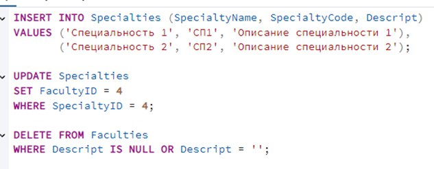
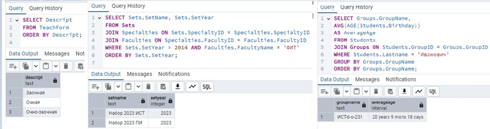
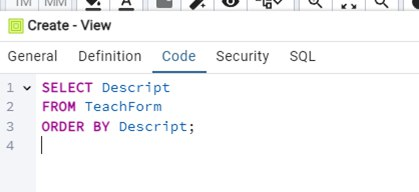
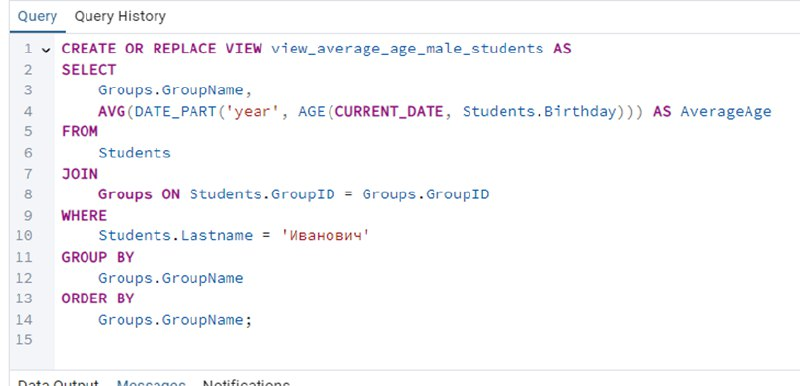
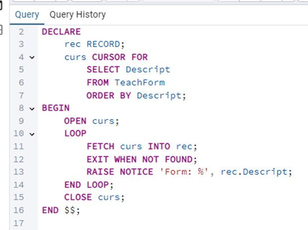
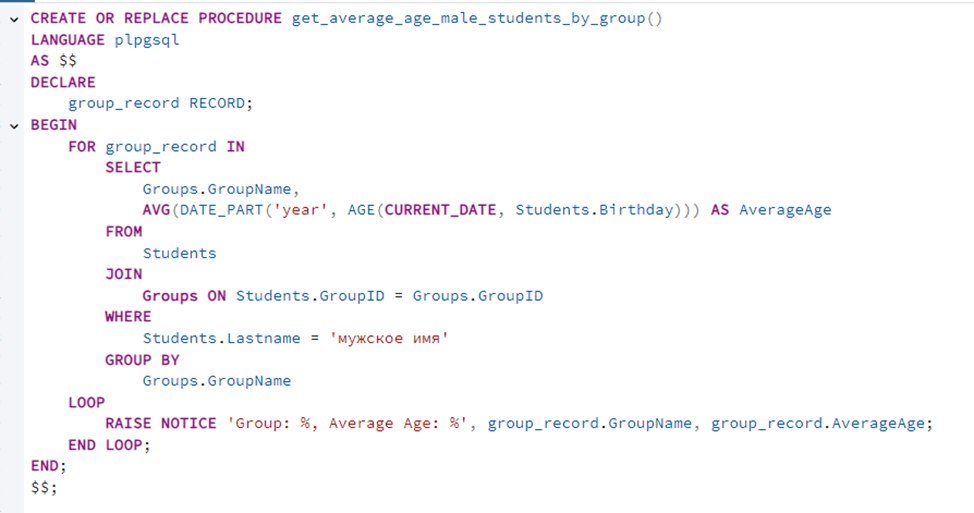
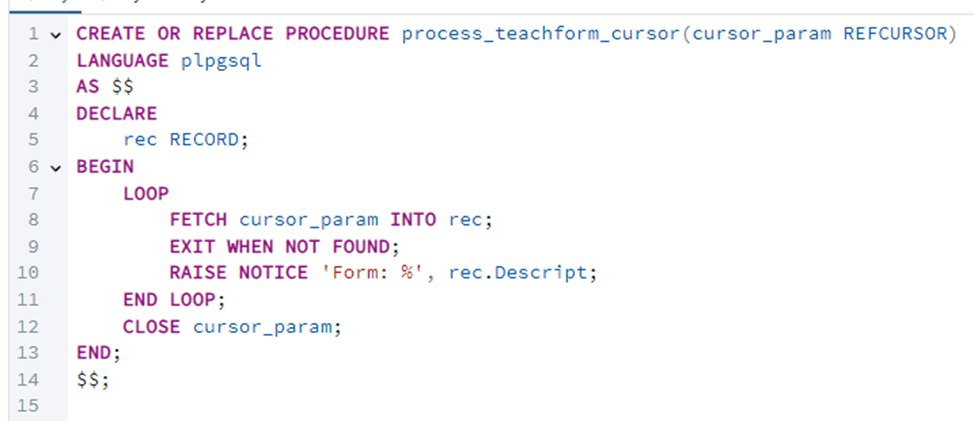
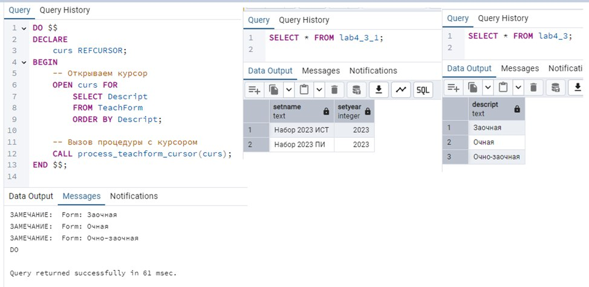

# Министерство высшего образования и науки Российской Федерации
## ФГБОУ ВО «Кубанский государственный технологический университет»
### Институт компьютерных систем и информационной безопасности
#### Кафедра информатики и вычислительной техники

---

# ЛАБОРАТОРНАЯ РАБОТА №3
**по дисциплине «Базы данных»**

---

**Выполнил студент группы 23-КБ-ПР2:**  
Фролов Андрей Андреевич

**Руководитель работы:**  
Киянов Илья Русланович

---

2025 г.

---

### Цель работы:
Овладение способами применения DML-команд SQL, изучение средств PostgreSQL для формирования выборок данных.

---

### Задания для самостоятельной работы:

1. **Задание 1.** При помощи утилиты SQL Shell (psql) с применением SQL-команд модификации данных (INSERT, UPDATE, DELETE) реализовать заданные модификации.
2. **Задание 2.** При помощи утилиты pgAdmin с применением команды SELECT составить и выполнить заданные запросы на выборку. Созданные бланки запросов сохранить на жестком диске.
3. **Задание 3.** При помощи pgAdmin создать конструктором представления, реализующие выборки 1 и 2.
4. **Задание 4.** При помощи pgAdmin и команды CREATE OR REPLACE VIEW создать представление, реализующее выборку 3.
5. **Задание 5.** При помощи pgAdmin и команды DECLARE CURSOR создать курсор, реализующий выборку 1.
6. **Задание 6.** При помощи pgAdmin и команды CREATE OR REPLACE PROCEDURE создать хранимую процедуру, возвращающую значение, вычисляемое в выборке 3.
7. **Задание 7.** При помощи pgAdmin создать конструктором хранимую процедуру с параметром-курсором, созданном в пункте 5.
8. **Задание 8.** Протестировать созданные объекты и убедиться в их работоспособности.

---

### Ход работы:

#### Задание 1.
Запросы на модификацию данных БД `Students` показаны на **рисунке 1**.




---

#### Задание 2.
Запросы на выборку данных при помощи SELECT. Результат показан на **рисунке 2**.



---

#### Задание 3.
Создание представления в конструкторе представлено на **рисунке 3**.



---

#### Задание 4.
Добавление представления при помощи команды CREATE OR REPLACE VIEW. Результат показан на **рисунке 4**.



---

#### Задание 5.
При помощи pgAdmin и команды DECLARE CURSOR создать курсор, реализующий выборку 1. Результат показан на **рисунке 5**.



---

#### Задание 6.
Добавление хранимой процедуры показано на **рисунке 6**.



---

#### Задание 7.
При помощи pgAdmin создать конструктором хранимую процедуру с параметром-курсором, созданном в пункте 5. Результат показан на **рисунке 7**.



---

#### Задание 8.
Проверка работоспособности созданных объектов представлена на **рисунке 8**.



---

### Контрольные вопросы:

1. **Подмножество языка SQL-DML. Команды модификации данных и особенности их использования.**  
   SQL-DML (Data Manipulation Language) включает команды для работы с данными в базе данных. Основные команды:
    - `INSERT`: Добавляет новые записи в таблицу.
    - `UPDATE`: Изменяет существующие записи в таблице.
    - `DELETE`: Удаляет записи из таблицы.
    - `SELECT`: Извлекает данные из таблицы (хотя это не команда модификации, она часто используется в DML).

2. **Подмножество языка SQL-DML. Команда SELECT и её синтаксис. Сортировка данных.**  
   Команда SELECT используется для извлечения данных из базы данных. Основной синтаксис:
   ```sql
   SELECT column1, column2, ...
   FROM table_name
   WHERE condition
   ORDER BY column1, column2, ... ASC|DESC;
   ```
    - `ORDER BY`: Используется для сортировки результатов.
    - `ASC`: По возрастанию (по умолчанию).
    - `DESC`: По убыванию.

3. **Операции загрузки и обновления данных в таблицах в PostgreSQL. Примеры.**
    - `INSERT`:
      ```sql
      INSERT INTO table_name (column1, column2, ...) VALUES (value1, value2, ...);
      ```  
    - `UPDATE`:
      ```sql
      UPDATE table_name SET column1 = value1, column2 = value2, ... WHERE condition;
      ```  
    - `DELETE`:
      ```sql
      DELETE FROM table_name WHERE condition;
      ```

4. **Команда SELECT и её синтаксис. Выборка из нескольких таблиц.**  
   Для выборки из нескольких таблиц используются соединения (JOIN):
    - `INNER JOIN`: Возвращает записи, имеющие совпадения в обеих таблицах.
    - `LEFT JOIN`: Возвращает все записи из левой таблицы и совпадающие записи из правой.
    - `RIGHT JOIN`: Возвращает все записи из правой таблицы и совпадающие записи из левой.
    - `FULL JOIN`: Возвращает записи, если есть совпадение в одной из таблиц.

5. **Выборка данных из нескольких таблиц: общая структура предложения FROM, виды соединений. Особенности применения и примеры.**  
   Общая структура:
   ```sql
   SELECT columns
   FROM table1
   JOIN table2 ON table1.common_field = table2.common_field
   WHERE condition;
   ```

6. **Структура и синтаксис предложения WHERE. Использование ALL, LIKE, ANY, IN, операторов сравнения.**  
   Предложение WHERE используется для фильтрации данных:
    - `ALL, ANY, SOME`: Используются для сравнения с подзапросами.
    - `LIKE`: Используется для поиска шаблонов.
    - `IN`: Проверяет наличие значения в списке.
    - Операторы сравнения: `=`, `<>`, `>`, `<`, `>=`, `<=`.

7. **Команда SELECT и её синтаксис. Расчеты с помощью функций. Группирование данных.**
    - Функции: `COUNT()`, `SUM()`, `AVG()`, `MAX()`, `MIN()`.
    - `GROUP BY`: Группирует результаты по одному или нескольким столбцам.
    - `HAVING`: Фильтрует группы, аналогично `WHERE`, но для групп.

8. **Представление в PostgreSQL. Создание представлений с помощью pgAdmin.**  
   Представление — это сохраненный SQL-запрос, который можно использовать как таблицу. Создается с помощью:
   ```sql
   CREATE VIEW view_name AS
   SELECT columns
   FROM tables
   WHERE condition;
   ```

9. **Курсоры в PostgreSQL. Создание курсоров с помощью pgAdmin.**  
   Курсоры позволяют обрабатывать результаты запроса по одной строке за раз. Создаются с помощью:
   ```sql
   DECLARE cursor_name CURSOR FOR SELECT ...;
   ```

10. **Использование в PostgreSQL представлений и курсоров. Особенности применения и отличия.**
    - Представления: Упрощают сложные запросы, обеспечивают безопасность данных.
    - Курсоры: Позволяют обрабатывать большие наборы данных по частям, экономя память.

11. **Использование в PostgreSQL курсоров и хранимых процедур. Особенности применения и отличия.**
    - Курсоры: Используются для поэтапной обработки данных.
    - Хранимые процедуры: Капсулируют логику, могут принимать параметры и возвращать результаты.

12. **Хранимые процедуры в PostgreSQL. Создание хранимых процедур с помощью pgAdmin.**  
    Создаются с помощью:
    ```sql
    CREATE PROCEDURE procedure_name (parameters)
    LANGUAGE plpgsql
    AS $$
    BEGIN
        -- procedure body
    END;
    $$;
    ```

13. **Ограничение при работе с хранимыми процедурами. Модификация и удаление сохраненных процедур.**
    - Модификация: Используется `CREATE OR REPLACE PROCEDURE`.
    - Удаление: Используется `DROP PROCEDURE procedure_name;`.

---
