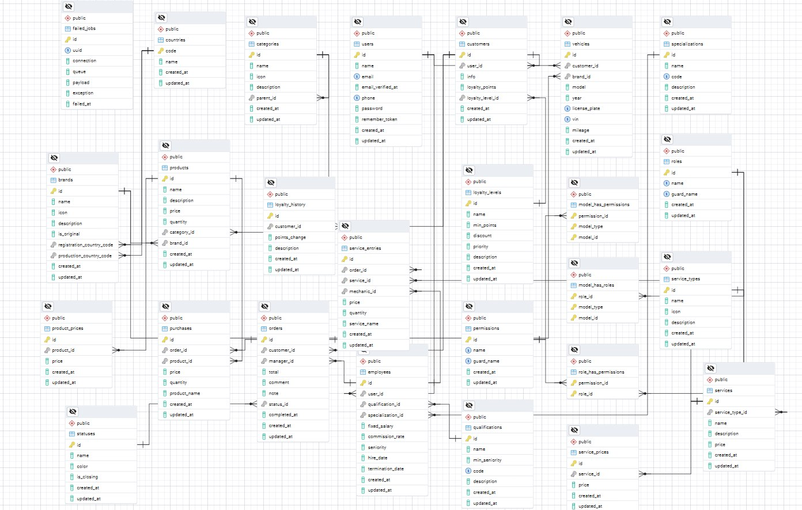
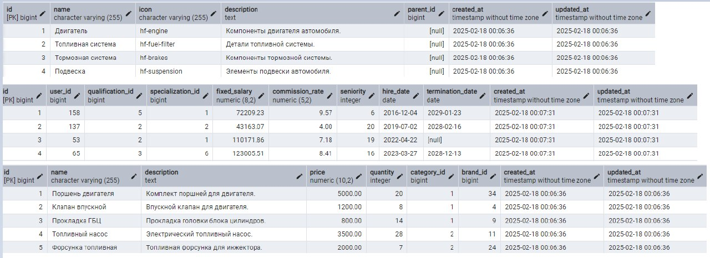

# Министерство высшего образования и науки Российской Федерации
## ФГБОУ ВО «Кубанский государственный технологический университет»
### Институт компьютерных систем и информационной безопасности
#### Кафедра информатики и вычислительной техники

---

# ЛАБОРАТОРНАЯ РАБОТА №5
**по дисциплине «Базы данных»**

--- 

**Выполнил студент группы 23-КБ-ПР2:**  
Фролов Андрей Андреевич

**Руководитель работы:**  
Киянов Илья Русланович

---

2025 г.

---

**Цель работы:**
Закрепление способов применения DDL-команд SQL и средств СУБД PostgreSQL для создания и структурной модификации БД.

---

**Задания для самостоятельной работы:**

**Задание 1.** При помощи инструментального средства pgAdmin и команд языка SQL-DDL разработать БД для приема данных заданной предметной области в соответствии со структурой БД, разработанной при выполнении лабораторной работы №2. При этом соблюсти все запроектированные ограничения и условия целостности данных. Для полей первичных ключей создать кластерные индексы.

**Задание 2.** В случае отступления от изначальных проектных решений обосновать изменения и представить структуру модифицированного отношения.

**Задание 3.** По согласованию с преподавателем посредством команды CREATE INDEX создать некластерные индексы для значимых полей таблиц БД.

**Задание 4.** По согласованию с преподавателем внести изменения в структуру БД.

**Задание 5.** Сформировать диаграмму базы данных.

**Задание 6.** Выполнить описание разработанных таблиц БД.

**Задание 7.** Ручным способом (непосредственно в поля таблицы с клавиатуры) ввести данные в таблицы, начиная со справочников, по 4−5 записей в каждую.

---

## Ход работы:

### Задание 1.

Запросы на создание основных таблиц БД представлены в листинге 1.

**Листинг 1 – SQL-DDL команды для создания таблиц**

```sql
CREATE TABLE countries (
    code CHAR(2) PRIMARY KEY,
    name VARCHAR(255) NOT NULL,
    created_at TIMESTAMP NULL,
    updated_at TIMESTAMP NULL
);

CREATE TABLE users (
    id BIGSERIAL PRIMARY KEY,
    name VARCHAR(255) NOT NULL,
    email VARCHAR(255) UNIQUE NULL,
    email_verified_at TIMESTAMP NULL,
    phone VARCHAR(20) UNIQUE NOT NULL,
    password VARCHAR(255) NOT NULL,
    remember_token TEXT NULL,
    created_at TIMESTAMP NULL,
    updated_at TIMESTAMP NULL
);

CREATE TABLE brands (
    id BIGSERIAL PRIMARY KEY,
    name VARCHAR(255) NOT NULL,
    icon VARCHAR(255) NULL,
    description TEXT NULL,
    is_original BOOLEAN NULL,
    registration_country_code CHAR(2) NULL,
    production_country_code CHAR(2) NULL,
    created_at TIMESTAMP NULL,
    updated_at TIMESTAMP NULL,
    FOREIGN KEY (registration_country_code) REFERENCES countries(code) ON DELETE SET NULL,
    FOREIGN KEY (production_country_code) REFERENCES countries(code) ON DELETE SET NULL
);

CREATE TABLE categories (
    id BIGSERIAL PRIMARY KEY,
    name VARCHAR(255) NOT NULL,
    icon VARCHAR(255) NULL,
    description TEXT NULL,
    parent_id BIGINT NULL,
    created_at TIMESTAMP NULL,
    updated_at TIMESTAMP NULL,
    FOREIGN KEY (parent_id) REFERENCES categories(id) ON DELETE CASCADE
);

CREATE TABLE customers (
    id BIGSERIAL PRIMARY KEY,
    user_id BIGINT NOT NULL,
    info TEXT NULL,
    loyalty_points INT DEFAULT 0,
    loyalty_level_id BIGINT NULL,
    created_at TIMESTAMP NULL,
    updated_at TIMESTAMP NULL,
    FOREIGN KEY (user_id) REFERENCES users(id) ON DELETE CASCADE,
    FOREIGN KEY (loyalty_level_id) REFERENCES loyalty_levels(id) ON DELETE SET NULL
);

CREATE TABLE loyalty_levels (
    id BIGSERIAL PRIMARY KEY,
    name VARCHAR(255) NOT NULL,
    min_points INT DEFAULT 0,
    discount DECIMAL(5, 2) NULL,
    priority INT DEFAULT 0,
    description TEXT NULL,
    created_at TIMESTAMP NULL,
    updated_at TIMESTAMP NULL
);

CREATE TABLE vehicles (
    id BIGSERIAL PRIMARY KEY,
    customer_id BIGINT NOT NULL,
    model_id BIGINT NOT NULL,
    year INT NOT NULL,
    license_plate VARCHAR(255) UNIQUE NOT NULL,
    vin VARCHAR(255) UNIQUE NULL,
    mileage INT NULL,
    created_at TIMESTAMP NULL,
    updated_at TIMESTAMP NULL,
    FOREIGN KEY (customer_id) REFERENCES customers(id) ON DELETE CASCADE,
    FOREIGN KEY (model_id) REFERENCES vehicle_models(id) ON DELETE CASCADE
);

CREATE TABLE vehicle_models (
    id BIGSERIAL PRIMARY KEY,
    brand_id BIGINT NOT NULL,
    name VARCHAR(255) NOT NULL,
    generation VARCHAR(255) NULL,
    start_year INT NULL,
    end_year INT NULL,
    is_facelift BOOLEAN DEFAULT FALSE,
    facelift_year INT NULL,
    created_at TIMESTAMP NULL,
    updated_at TIMESTAMP NULL,
    FOREIGN KEY (brand_id) REFERENCES brands(id) ON DELETE CASCADE
);

CREATE TABLE orders (
    id BIGSERIAL PRIMARY KEY,
    customer_id BIGINT NOT NULL,
    vehicle_id BIGINT NOT NULL,
    manager_id BIGINT NULL,
    total DECIMAL(10, 2) NULL,
    comment TEXT NULL,
    note TEXT NULL,
    status_id BIGINT NOT NULL,
    completed_at TIMESTAMP NULL,
    created_at TIMESTAMP NULL,
    updated_at TIMESTAMP NULL,
    FOREIGN KEY (customer_id) REFERENCES customers(id) ON DELETE CASCADE,
    FOREIGN KEY (vehicle_id) REFERENCES vehicles(id) ON DELETE CASCADE,
    FOREIGN KEY (manager_id) REFERENCES employees(id) ON DELETE SET NULL,
    FOREIGN KEY (status_id) REFERENCES statuses(id) ON DELETE CASCADE
);

CREATE TABLE statuses (
    id BIGSERIAL PRIMARY KEY,
    name VARCHAR(255) NOT NULL,
    color VARCHAR(255) NOT NULL,
    is_closing BOOLEAN DEFAULT FALSE,
    created_at TIMESTAMP NULL,
    updated_at TIMESTAMP NULL
);

CREATE TABLE products (
    id BIGSERIAL PRIMARY KEY,
    name VARCHAR(255) NOT NULL,
    description TEXT NULL,
    price DECIMAL(10, 2) NULL,
    quantity INT DEFAULT 0,
    category_id BIGINT NOT NULL,
    brand_id BIGINT NOT NULL,
    created_at TIMESTAMP NULL,
    updated_at TIMESTAMP NULL,
    FOREIGN KEY (category_id) REFERENCES categories(id) ON DELETE CASCADE,
    FOREIGN KEY (brand_id) REFERENCES brands(id) ON DELETE CASCADE
);

CREATE TABLE services (
    id BIGSERIAL PRIMARY KEY,
    service_type_id BIGINT NOT NULL,
    name VARCHAR(255) NOT NULL,
    description TEXT NULL,
    price DECIMAL(10, 2) NOT NULL,
    created_at TIMESTAMP NULL,
    updated_at TIMESTAMP NULL,
    FOREIGN KEY (service_type_id) REFERENCES service_types(id) ON DELETE CASCADE
);

CREATE TABLE service_types (
    id BIGSERIAL PRIMARY KEY,
    name VARCHAR(255) NOT NULL,
    icon VARCHAR(255) NULL,
    description TEXT NULL,
    created_at TIMESTAMP NULL,
    updated_at TIMESTAMP NULL
);

CREATE TABLE employees (
    id BIGSERIAL PRIMARY KEY,
    user_id BIGINT NULL,
    qualification_id BIGINT NULL,
    specialization_id BIGINT NULL,
    fixed_salary DECIMAL(8, 2) NULL,
    commission_rate DECIMAL(5, 2) NULL,
    seniority INT NOT NULL,
    hire_date DATE NOT NULL,
    termination_date DATE NULL,
    created_at TIMESTAMP NULL,
    updated_at TIMESTAMP NULL,
    FOREIGN KEY (user_id) REFERENCES users(id) ON DELETE SET NULL,
    FOREIGN KEY (qualification_id) REFERENCES qualifications(id) ON DELETE SET NULL,
    FOREIGN KEY (specialization_id) REFERENCES specializations(id) ON DELETE SET NULL
);

CREATE TABLE qualifications (
    id BIGSERIAL PRIMARY KEY,
    name VARCHAR(255) NOT NULL,
    min_seniority INT NOT NULL,
    code CHAR(3) UNIQUE NOT NULL,
    description TEXT NULL,
    created_at TIMESTAMP NULL,
    updated_at TIMESTAMP NULL
);

CREATE TABLE specializations (
    id BIGSERIAL PRIMARY KEY,
    name VARCHAR(255) NOT NULL,
    code CHAR(4) UNIQUE NOT NULL,
    description TEXT NULL,
    created_at TIMESTAMP NULL,
    updated_at TIMESTAMP NULL
);
```

### Задание 2.

В рамках анализа проектных решений следует отметить, что база данных изначально спроектирована с высокой степенью рациональности и соответствия современным требованиям к организации данных. Существующая структура отношений демонстрирует оптимальное соответствие принципам нормализации, обеспечивая целостность данных и эффективность выполнения запросов. Ввиду полной готовности текущей реализации и её адекватного покрытия требований предметной области, внесение изменений не представляется целесообразным. Таким образом, доработка базы данных не требуется, так как она уже отвечает всем необходимым критериям функциональности, производительности и масштабируемости.

### Задание 3.

Создание некластерных индексов представлено в листинге 2.

**Листинг 2 – создание некластерных индексов**

```sql
CREATE INDEX idx_brands_name ON brands(name);
CREATE INDEX idx_brands_is_original ON brands(is_original);

CREATE INDEX idx_categories_name ON categories(name);
CREATE INDEX idx_categories_parent_id ON categories(parent_id);

CREATE INDEX idx_countries_name ON countries(name);

CREATE INDEX idx_customers_user_id ON customers(user_id);
CREATE INDEX idx_customers_loyalty_points ON customers(loyalty_points);
CREATE INDEX idx_customers_loyalty_level_id ON customers(loyalty_level_id);

CREATE INDEX idx_employees_user_id ON employees(user_id);
CREATE INDEX idx_employees_qualification_id ON employees(qualification_id);
CREATE INDEX idx_employees_specialization_id ON employees(specialization_id);
CREATE INDEX idx_employees_seniority ON employees(seniority);

CREATE INDEX idx_loyalty_levels_min_points ON loyalty_levels(min_points);
CREATE INDEX idx_loyalty_levels_discount ON loyalty_levels(discount);

CREATE INDEX idx_orders_customer_id ON orders(customer_id);
CREATE INDEX idx_orders_vehicle_id ON orders(vehicle_id);
CREATE INDEX idx_orders_manager_id ON orders(manager_id);
CREATE INDEX idx_orders_status_id ON orders(status_id);
CREATE INDEX idx_orders_completed_at ON orders(completed_at);

CREATE INDEX idx_products_name ON products(name);
CREATE INDEX idx_products_price ON products(price);
CREATE INDEX idx_products_quantity ON products(quantity);
CREATE INDEX idx_products_category_id ON products(category_id);
CREATE INDEX idx_products_brand_id ON products(brand_id);

CREATE INDEX idx_product_prices_product_id ON product_prices(product_id);
CREATE INDEX idx_product_prices_price ON product_prices(price);

CREATE INDEX idx_purchases_order_id ON purchases(order_id);
CREATE INDEX idx_purchases_product_id ON purchases(product_id);
CREATE INDEX idx_purchases_price ON purchases(price);

CREATE INDEX idx_qualifications_code ON qualifications(code);
CREATE INDEX idx_qualifications_min_seniority ON qualifications(min_seniority);

CREATE INDEX idx_services_service_type_id ON services(service_type_id);
CREATE INDEX idx_services_name ON services(name);
CREATE INDEX idx_services_price ON services(price);

CREATE INDEX idx_service_entries_order_id ON service_entries(order_id);
CREATE INDEX idx_service_entries_service_id ON service_entries(service_id);
CREATE INDEX idx_service_entries_mechanic_id ON service_entries(mechanic_id);
CREATE INDEX idx_service_entries_price ON service_entries(price);

CREATE INDEX idx_service_prices_service_id ON service_prices(service_id);
CREATE INDEX idx_service_prices_price ON service_prices(price);

CREATE INDEX idx_service_types_name ON service_types(name);

CREATE INDEX idx_specializations_code ON specializations(code);

CREATE INDEX idx_statuses_name ON statuses(name);
CREATE INDEX idx_statuses_is_closing ON statuses(is_closing);

CREATE INDEX idx_users_name ON users(name);
CREATE INDEX idx_users_email ON users(email);
CREATE INDEX idx_users_phone ON users(phone);

CREATE INDEX idx_vehicles_customer_id ON vehicles(customer_id);
CREATE INDEX idx_vehicles_model_id ON vehicles(model_id);
CREATE INDEX idx_vehicles_year ON vehicles(year);
CREATE INDEX idx_vehicles_license_plate ON vehicles(license_plate);
CREATE INDEX idx_vehicles_vin ON vehicles(vin);
CREATE INDEX idx_vehicles_mileage ON vehicles(mileage);

CREATE INDEX idx_vehicle_models_brand_id ON vehicle_models(brand_id);
CREATE INDEX idx_vehicle_models_name ON vehicle_models(name);
CREATE INDEX idx_vehicle_models_start_year ON vehicle_models(start_year);
CREATE INDEX idx_vehicle_models_end_year ON vehicle_models(end_year);
```

### Задание 4.

В результате анализа текущей структуры базы данных было принято решение об отсутствии необходимости внесения изменений. База данных изначально разработана с учетом всех ключевых аспектов предметной области, обеспечивая высокую степень нормализации, целостности данных и производительности запросов. Представленная структура таблиц демонстрирует рациональный подход к организации данных, где каждое отношение четко отражает свою функциональную роль. Таким образом, дополнительные изменения не требуются, поскольку существующая реализация полностью соответствует предъявляемым требованиям и готова к использованию в заданных условиях.

### Задание 5.

Диаграмма БД на рисунке 1.



### Задание 6.

Описание основных таблиц разработанной БД изложено в таблице 1.

**Таблица 1 – описание основных таблиц БД**

| №  | Имя таблицы         | Описание                                                                 |
|----|---------------------|--------------------------------------------------------------------------|
| 1  | `brands`           | Таблица для хранения информации о брендах, включая их названия, иконки и описание. |
| 2  | `categories`       | Таблица для хранения категорий товаров с поддержкой иерархической структуры через `parent_id`. |
| 3  | `countries`        | Таблица для хранения данных о странах, используемых для регистрации и производства брендов. |
| 4  | `customers`        | Таблица для хранения информации о клиентах, включая связь с пользователями и уровнем лояльности. |
| 5  | `employees`        | Таблица для хранения данных о сотрудниках, их квалификациях и специализациях. |
| 6  | `loyalty_levels`   | Таблица для хранения уровней лояльности клиентов и связанных с ними бонусов. |
| 7  | `orders`           | Таблица для хранения информации о заказах, включая статусы и связь с клиентами и транспортными средствами. |
| 8  | `products`         | Таблица для хранения данных о товарах, включая их категории, бренды и цены. |
| 9  | `purchases`        | Таблица для отслеживания покупок товаров в рамках заказов.                |
| 10 | `qualifications`   | Таблица для хранения данных о квалификациях сотрудников.                  |
| 11 | `services`         | Таблица для хранения информации об услугах, включая их типы и цены.        |
| 12 | `service_entries`  | Таблица для отслеживания записей об услугах, оказанных в рамках заказов.   |
| 13 | `specializations`  | Таблица для хранения данных о специализациях сотрудников.                 |
| 14 | `statuses`         | Таблица для хранения статусов заказов (например, "новый", "завершен").     |
| 15 | `users`            | Таблица для хранения информации о пользователях системы: клиенты, сотрудники и администраторы. |
| 16 | `vehicles`         | Таблица для хранения данных о транспортных средствах клиентов.            |
| 17 | `vehicle_models`   | Таблица для хранения моделей транспортных средств, связанных с брендами.   |
| 18 | `loyalty_history`  | Таблица для отслеживания истории начисления баллов лояльности клиентов.    |
| 19 | `service_types`    | Таблица для хранения типов услуг (например, "диагностика", "ремонт").      |
| 20 | `product_prices`   | Таблица для хранения исторических данных о ценах товаров.                 |
| 21 | `service_prices`   | Таблица для хранения исторических данных о ценах услуг.                   |

---

### Задание 7.

Вручную были заполнены данные в каждую таблицу, пример заполнения представлен на рисунке 4.



---


