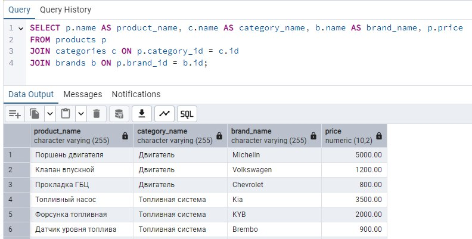
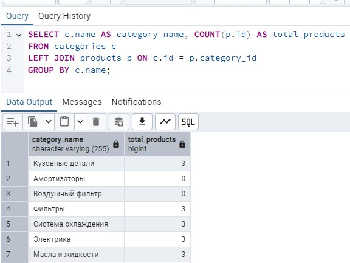
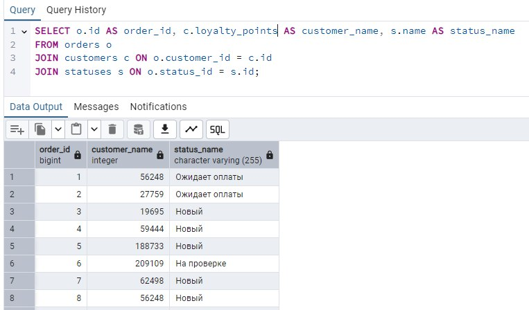
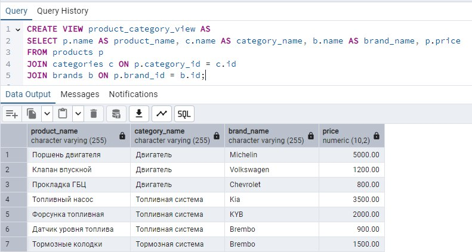
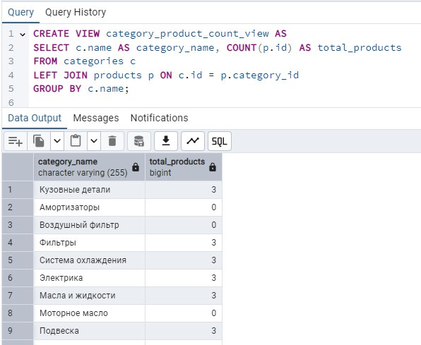

# Министерство высшего образования и науки Российской Федерации
## ФГБОУ ВО «Кубанский государственный технологический университет»
### Институт компьютерных систем и информационной безопасности
#### Кафедра информатики и вычислительной техники

---

# ЛАБОРАТОРНАЯ РАБОТА №6
**по дисциплине «Базы данных»**

---

**Выполнил студент группы 23-КБ-ПР2:**  
Фролов Андрей Андреевич

**Руководитель работы:**  
Киянов Илья Русланович

---

2025 г.

---

**Цель работы:**
Закрепление способов применения DML-команд SQL и средств СУБД PostgreSQL для управления данными в БД.

**Задания для самостоятельной работы:**

**Задание 1.** При помощи языка SQL-DML написать и протестировать команды для управления данными БД, разработанной при выполнении лабораторной работы №5 (для каждой таблицы):

- добавление записи;
- изменение всех полей данных записи, идентифицированной значением первичного ключа;
- удаление записи, идентифицированной значением первичного ключа.

**Задание 2.** При помощи разработанных команд добавления записей ввести в таблицы тестовые наборы данных, достаточные для тестирования запросов, разработка которых предусмотрена в п.3 задания.

**Задание 3.** При помощи pgAdmin и команды SELECT по согласованию с преподавателем разработать не менее трех запросов, предусматривающих соединение, выборку и проекцию отношений БД, в том числе запросы с использованием групповых операций, а также операций переименования атрибутов результатного отношения.

**Задание 4.** При помощи pgAdmin разработать представления для формирования выходных данных, согласно модели «Черный ящик», разработанной при выполнении лабораторной работы №1.

## Ход работы:

### Задание 1.

Запросы на манипуляцию данными представлены в листинге 1.

**Листинг 1 – SQL-DML команды**

```sql
INSERT INTO brands (name, icon, description, is_original, registration_country_code, production_country_code)
VALUES ('NewBrand', 'icon-brand', 'Описание нового бренда', true, 'US', 'US');

UPDATE brands
SET name = 'UpdatedBrand', icon = 'icon-updated', description = 'Обновленное описание', is_original = false, registration_country_code = 'DE', production_country_code = 'DE'
WHERE id = 1;

DELETE FROM brands WHERE id = 1;


INSERT INTO categories (name, icon, description, parent_id)
VALUES ('NewCategory', 'icon-category', 'Описание новой категории', NULL);

UPDATE categories
SET name = 'UpdatedCategory', icon = 'icon-updated', description = 'Обновленное описание', parent_id = 2
WHERE id = 1;

DELETE FROM categories WHERE id = 1;


INSERT INTO customers (user_id, info, loyalty_points, loyalty_level_id)
VALUES (1, 'Информация о клиенте', 100, 1);

UPDATE customers
SET user_id = 2, info = 'Обновленная информация', loyalty_points = 200, loyalty_level_id = 2
WHERE id = 1;

DELETE FROM customers WHERE id = 1;
```

### Задание 2.

Запросы на добавление данных в БД. Результат в листинге 2.

**Листинг 2 – добавление данных в БД**

```sql
INSERT INTO brands (name, icon, description, is_original, registration_country_code, production_country_code)
VALUES 
('BrandA', 'icon-a', 'Description A', true, 'US', 'US'),
('BrandB', 'icon-b', 'Description B', false, 'DE', 'DE');

INSERT INTO categories (name, icon, description, parent_id)
VALUES 
('Category1', 'icon-1', 'Description 1', NULL),
('SubCategory1', 'icon-sub1', 'Description Sub1', 1);

INSERT INTO products (name, description, price, quantity, category_id, brand_id)
VALUES 
('Product1', 'Description Product1', 100.00, 10, 1, 1),
('Product2', 'Description Product2', 200.00, 5, 2, 2);
```

### Задание 3.

**Запрос 1:** Соединение таблиц представлено на рисунке 1.



**Запрос 2:** Групповые операции. Результат на рисунке 2.



**Запрос 3:** Переименование атрибутов. Результат на рисунке 3.



### Задание 4.

**Представление:** Список книг с их авторами представлен на рисунке 4.



**Представление:** Информация о заказах с детализацией по книгам представлена на рисунке 5.


```
