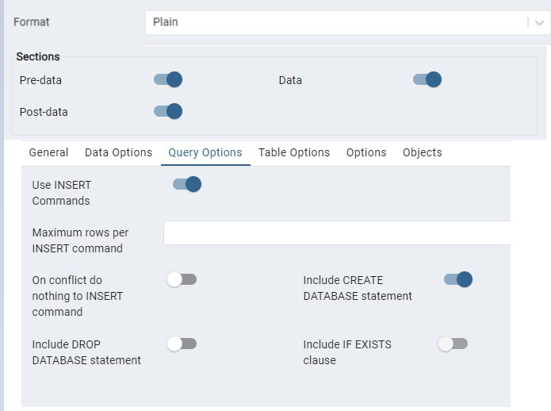
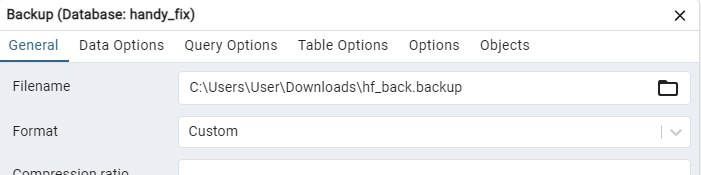
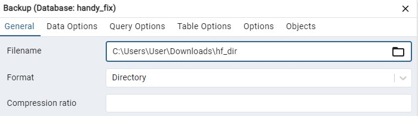
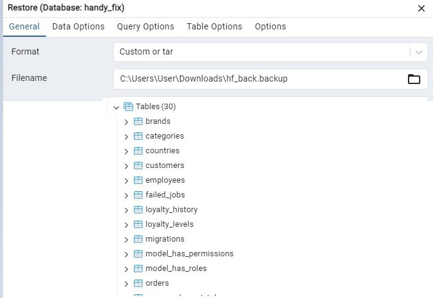
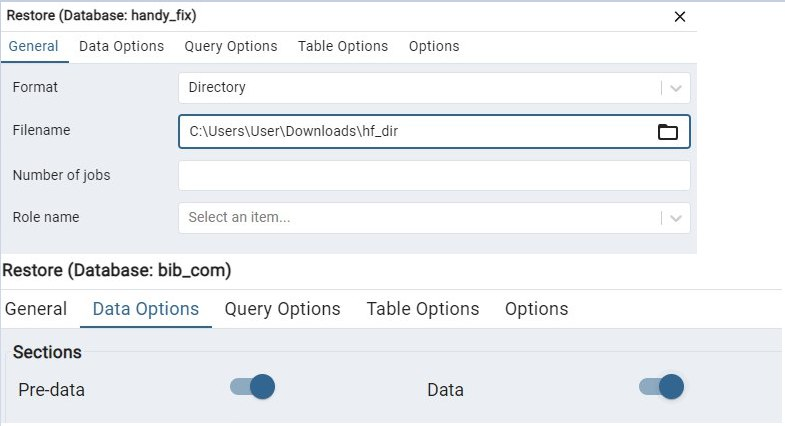
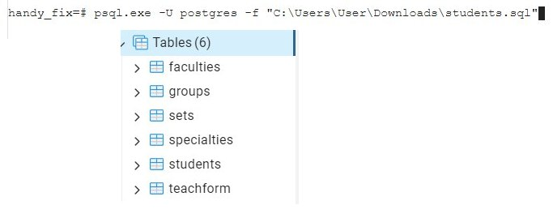
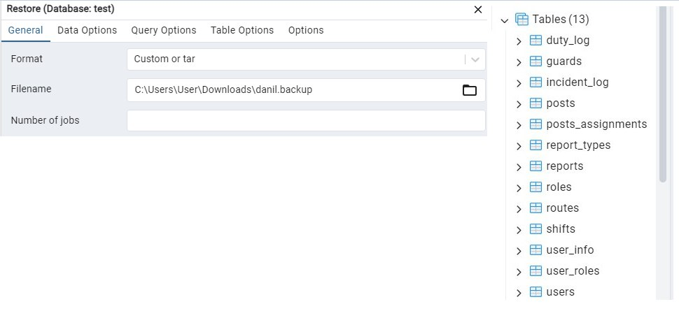

# Министерство высшего образования и науки Российской Федерации
## ФГБОУ ВО «Кубанский государственный технологический университет»
### Институт компьютерных систем и информационной безопасности
#### Кафедра информатики и вычислительной техники

---

# ЛАБОРАТОРНАЯ РАБОТА №7
**по дисциплине «Базы данных»**

---

**Выполнил студент группы 23-КБ-ПР2:**  
Фролов Андрей Андреевич

**Руководитель работы:**  
Киянов Илья Русланович

---

2025 г.

---

**Цель работы:**
Освоение способов применения DML-команд SQL, изучение средств PostgreSQL для формирования выборок данных.

**Задания для самостоятельной работы:**

**Задание 1.** Создать резервную копию типа Plain text для базы данных, разработанной при выполнении лабораторной работы №3. Секции для сохранения: Pre-data, Data, Post-data. Опции: включить CREATE DATABASE, использовать Insert команды. После чего переименовать или удалить эту базу данных.

**Задание 2.** Создать резервную копию типа Custom для базы данных, разработанной при выполнении лабораторной работы №5. Секции для сохранения: Pre-data. Сжатие 9, кодировка Win1251.

**Задание 3.** Создать резервную копию типа Directory для базы данных, разработанной лабораторной работы №5. Секции для сохранения: Data, Post-data. Сжатие 9, кодировка Win1251. Опции: использовать Insert команды. После чего переименовать или удалить эту базу данных.

**Задание 4.** Восстановить структуру базы данных, создав новую пустую базу и с помощью инструментов восстановления загрузить Pre-data секцию из Custom резервной копии, полученной в п. 2.

**Задание 5.** Восстановить данные в базе полученной в п. 4. С помощью инструментов восстановления загрузить Data и Post-data секции из Directory резервной копии, полученной в п. 3.

**Задание 6.** При помощи утилиты psql запустить Plain text SQL скрипт для восстановления базы данных, из файла, полученного в п. 1. `psql.exe -U postgres -f "C:\Folder\StudentsDB.sql"`.

**Задание 7.** *Дополнительное задание: Передать свои Custom и Directory резервные копии базы данных другому студенту в своей группе (или на другой компьютер). Получить резервные копии базы данных от другого студента (или с другого компьютера). Восстановить на своём сервере базу данных полученную от другого студента (или с другого компьютера).

---

## Ход работы:

### Задание 1.

Создание резервной копии типа Plain text для базы данных на рисунке 1.

---

### Задание 2.

Создание резервной копии типа Custom для базы данных. Результат на рисунке 2.

---

### Задание 3.

Создание резервной копии типа Directory представлено на рисунке 3.

---

### Задание 4.

Восстановление структуры БД из Custom. Результат на рисунке 4.

---

### Задание 5.

Восстановление структуры БД из Directory. Результат на рисунке 5.

---

### Задание 6.

При помощи утилиты psql запустил Plain text SQL скрипт для восстановления базы данных. Результат на рисунке 6.

---

### Задание 7.

Получил резервные копии базы данных от другого студента и восстановил БД на своём сервере. Результат на рисунке 7.

