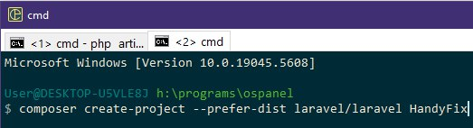
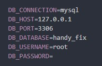
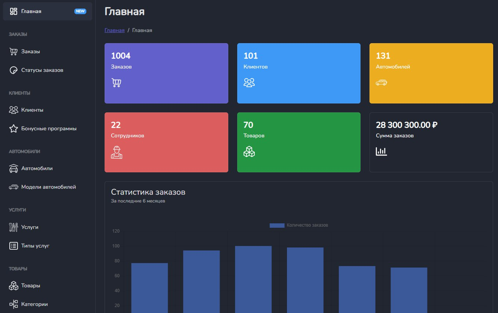
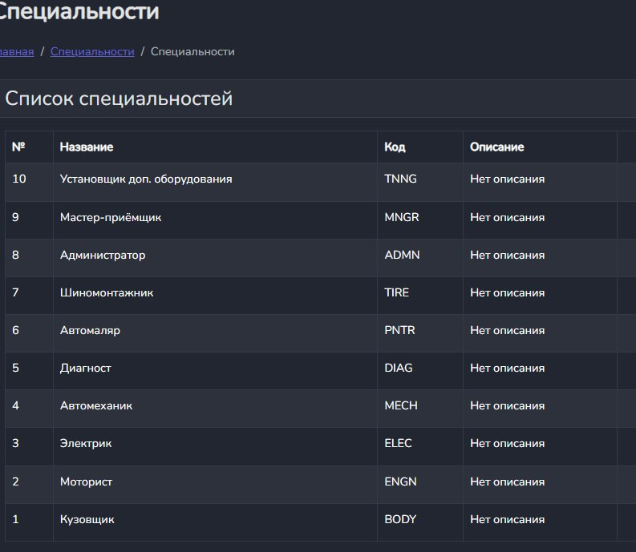
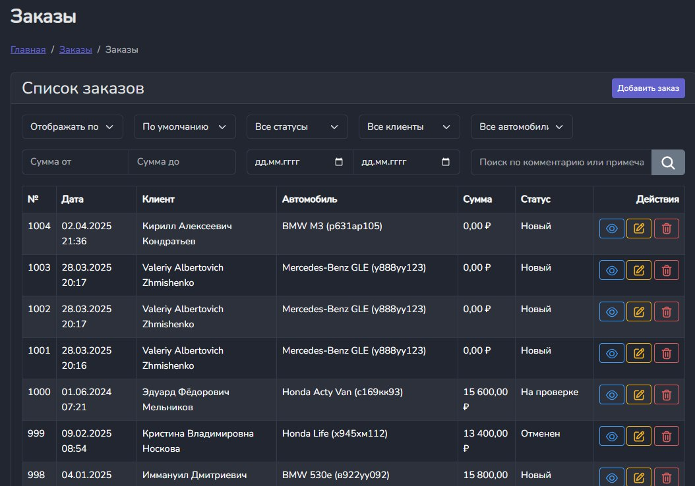
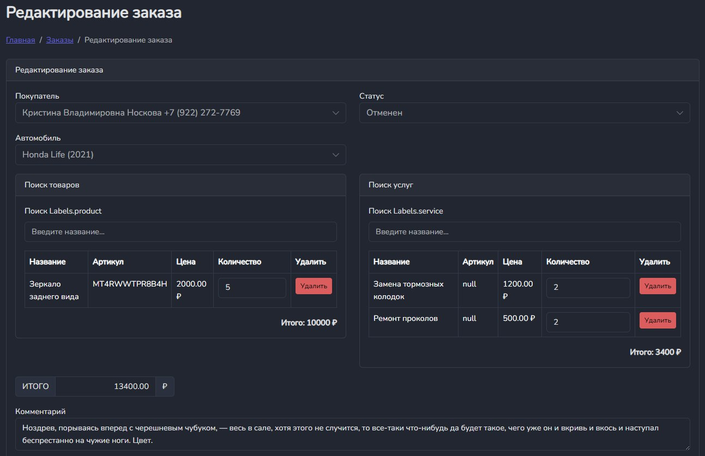

# Министерство высшего образования и науки Российской Федерации
## ФГБОУ ВО «Кубанский государственный технологический университет»
### Институт компьютерных систем и информационной безопасности
#### Кафедра информатики и вычислительной техники

---

# ЛАБОРАТОРНАЯ РАБОТА №8
**по дисциплине «Базы данных»**

---

**Выполнил студент группы 23-КБ-ПР2:**  
Фролов Андрей Андреевич

**Руководитель работы:**  
Киянов Илья Русланович

---

2025 г.

---

**Цель работы:**
Освоение способов применения DML-команд SQL, изучение средств PostgreSQL для формирования выборок данных.

**Задания для самостоятельной работы:**

1. **Создать в MS Visual Studio проект типа Windows Forms.**
2. **Создать подключение к базе данных, разработанной при выполнении лабораторной работы №5. Обеспечить видимость соединения во всех формах приложения.**
3. **В главной форме создать основное меню, состоящее из 5 пунктов:**
   - «Справочники» – отображение справочных данных;
   - «Данные» – отображение оперативных данных;
   - «Отчеты» – вывод результатов запросов к представлениям, созданным в лабораторной работе №6, которые отражают модель черный ящик из лабораторной работы №1;
   - «О программе» – выдача справки и данных о приложении и разработчиках;
   - «Выход» – выход из приложения.
4. **Создать формы для отображения справочников. Каждую форму связать с соответствующим подпунктом главного меню «Справочники».
5. **Создать формы для отображения оперативных данных. Каждую форму связать с соответствующим подпунктом главного меню «Данные».
6. **Разработать статическую форму сведений о программе и связать ее с соответствующим пунктом меню.**
7. **Выполнить описание разработанных форм приложения.**

## Ход работы:

### Задание 1.

Создание нового проекта представлено на рисунке 1.

### Задание 2.

Создание подключения к БД. Результат на рисунке 2.

### Задание 3.

Создание главной формы с необходимыми переходами представлено на рисунке 3.

### Задание 4.

Создание формы для отображения справочных данных. Результат на рисунке 4.

### Задание 5.

Создания формы для отображения оперативных данных – Заказы. Результат на рисунке 5.

### Задание 6.

Разработка формы редактирования заказа. Результат на рисунке 6.

### Задание 7.

Описание разработанных форм приложения описано в таблице 1.

#### Таблица 1 – Описание разработанных форм

| № | Имя формы | Описание |
|----|-----------|----------|
| 1 | Главная | Основная страница системы с общей статистикой, последними заказами и важными уведомлениями |
| 2 | Заказы | Страница управления заказами с возможностью просмотра, создания и редактирования заказов на ремонт и обслуживание |
| 3 | Статусы заказов | Форма для просмотра и управления статусами заказов, отслеживание этапов выполнения работ |
| 4 | Клиенты | Страница со списком клиентов, их контактными данными и историей обращений |
| 5 | Бонусные программы | Управление системой лояльности, настройка и просмотр бонусных программ для клиентов |
| 6 | Автомобили | Реестр обслуживаемых автомобилей с информацией о каждом транспортном средстве |
| 7 | Модели автомобилей | Справочник моделей автомобилей с техническими характеристиками |
| 8 | Услуги | Каталог предоставляемых сервисных услуг с описанием и стоимостью |
| 9 | Типы услуг | Классификатор типов предоставляемых услуг и работ |
| 10 | Товары и Категории | Управление складом запчастей и расходных материалов, их категоризация |                                                                                                                                                                                                                                                                                                                                                                                                                                                                                                                                                                                                                                                                                                                                                                                                                                                                                                                                                                                                                                                                                                                                                                                                                                                                                                                                                                                                                                                                                                                                                                                                                                                                                                                                                                                                                                                                                                                                                                                                                                                                                                                                                                                                                                                                                                                                                                                                                                                                                                                                                                                                                                                                                                                                                                                                                                                                                                                                                                                                                                                                                                                                                                                                                                                          