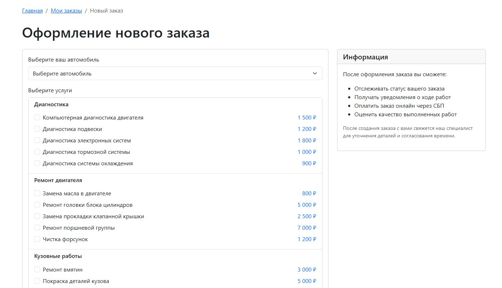
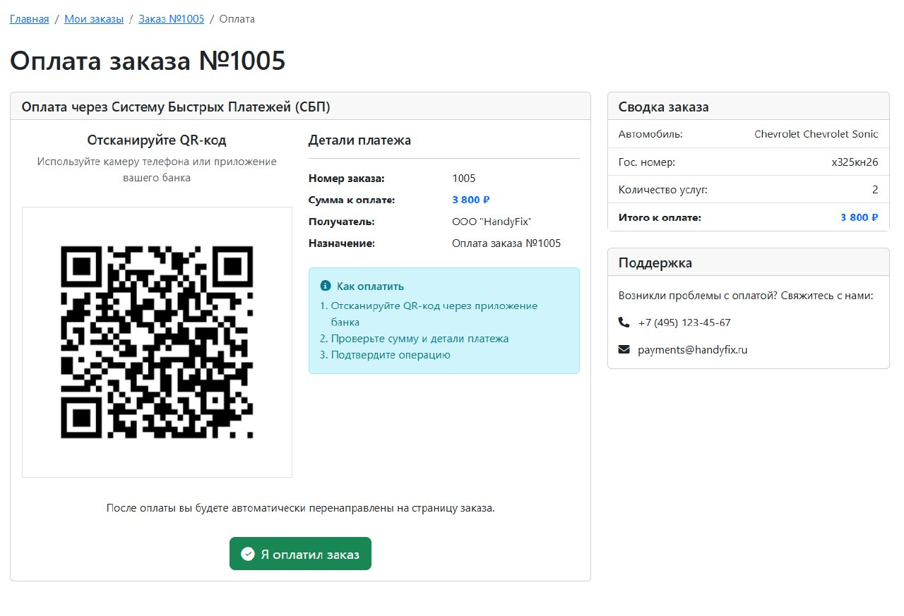
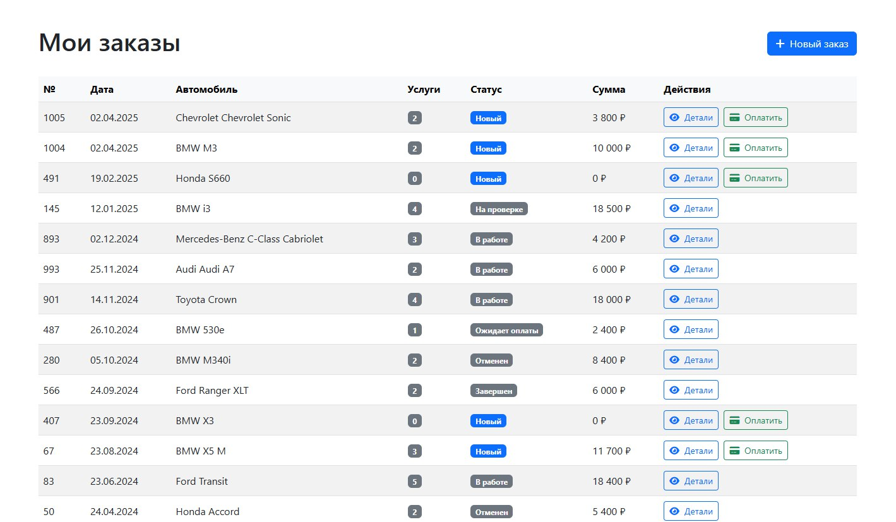
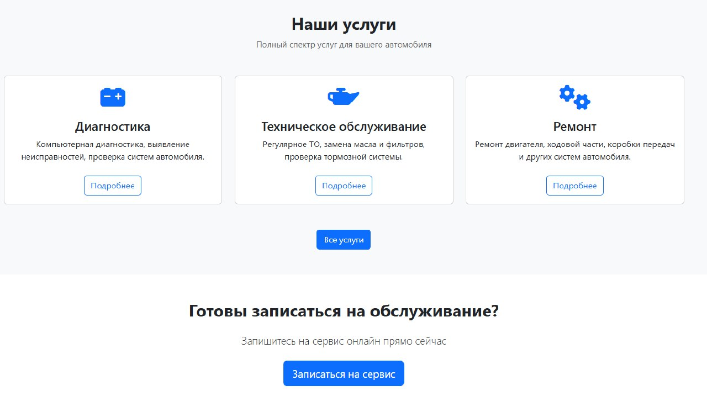

# Министерство высшего образования и науки Российской Федерации
## ФГБОУ ВО «Кубанский государственный технологический университет»
### Институт компьютерных систем и информационной безопасности
#### Кафедра информатики и вычислительной техники

---

# ЛАБОРАТОРНАЯ РАБОТА №9
**по дисциплине «Базы данных»**

---

**Выполнил студент группы 23-КБ-ПР2:**  
Фролов Андрей Андреевич

**Руководитель работы:**  
Киянов Илья Русланович

---

2025 г.

---

**Цель работы:**
Построение CRUD приложения для работы с базой данных PostgreSQL в MS Visual Studio 2019.

**Задания для самостоятельной работы:**

1. **В базу данных, разработанную в ходе лабораторной работы №5, добавить на первичные ключи всех таблиц IDENTITY GENERATED ALWAYS, если ещё не было установлено, для того чтобы ID генерировался автоматически.**

2. **Открыть в MS Visual Studio проект Windows Forms, разработанный в лабораторной работе №8. Создать универсальную форму, которая будет соответствовать модели CRUD (Create, Read, Update, Delete). Обеспечить открытие формы только в режиме R (Read), скрывая кнопки для других действий.**

   2.1. **Read.** Обеспечить в форме чтение и отображение таблицы или представления из базы данных. Построить чтение данных таким образом, чтобы они возвращались с разделением на страницы (paginated view) с настраиваемым размером.

   2.2. **Delete.** Создать кнопку удаления, при нажатии на которую все выбранные записи удаляются из базы данных.

   2.3. **Для каждой таблицы создать свою форму добавления/изменения. Для ввода данных использовать TextBox. Для получения внешних ключей обеспечить возможность открывать универсальную CRUD форму в режиме R для таблицы из которой должен быть получен id Ключа, и получать ID выбранной записи после её закрытия.**

   2.4. **Create.** Создать кнопку добавления, при нажатии на которую открывается форма добавления/изменения записи с пустыми полями.

   2.5. **Update.** Создать кнопку изменения, при нажатии на которую открывается форма добавления/изменения записи с предзаполненными полями. Поля заполняются получением данных из родительской формы.

3. **В главной форме изменить основное меню. В пунктах «Справочники» и «Данные» вызывать универсальную CRUD форму для таблиц. В пункте «Отчеты» вызывать универсальную CRUD форму в режиме R.**

4. **Выполнить описание разработанных форм приложения.**

## Ход работы:

### Задание 1.

В разработанной базе данных уже созданы первичные ключи всех таблиц IDENTITY GENERATED ALWAYS.

### Задание 2.1.

Форма для чтения данных из таблицы заказов. Результат на рисунке 1.

### Задание 2.2.

Форма для оплаты заказа. Результат на рисунке 2.

### Задание 2.3.

Форма добавления/обновления данных в таблице заказов. Результат на рисунке 3.

### Задание 2.4.

Кнопка добавления заказа. Результат на рисунке 4.

### Задание 2.5.

Кнопка просмотра/оплаты заказа. Результат на рисунке 5.

### Задание 3.

Создание главной формы представлено на рисунке 3.

### Задание 4.

Описание разработанных форм приложения описано в таблице 1.

#### Таблица 1 – Описание разработанных форм

| №  | Имя формы     | Описание
|----|---------------|----------
| 1  | Главная страница (home.blade.php) | Основная страница сайта с информацией о сервисе, акциями и новостями
| 2  | Авторизация (auth/) | Страницы для входа и регистрации пользователей
| 3  | Профиль (profile/) | Личный кабинет пользователя с информацией о клиенте и его заказах
| 4  | Услуги (services/) | Каталог предоставляемых услуг с описанием и ценами
| 5  | Транспортные средства (vehicles/) | Управление транспортными средствами клиента
| 6  | Заказы (orders/) | История заказов и возможность создания новых заказов